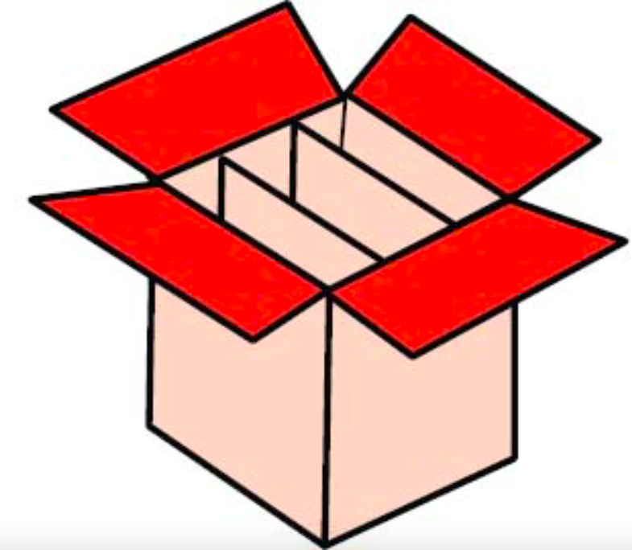

```{r setup, include=FALSE}
library(tidyverse)
library(plyr)
library(knitr)
opts_chunk$set(fig.align = T, warning = F, comment = NULL)
source('creacion_objetos.R')
```


background-image: url(imagenes_fondo/ppt_2_cuerpo.png)
background-size: contain

# Contenido

.pull-left[
1. Objetos, sus tipos y sus clases

2. Filtrar o indexar objetos

3. Ejemplos de aplicación: 

    * Regresión logística
    * Análisis de Componentes Principales
    * Pruebas Chi-cuadrado
]

--

.pull-right[
Además, para la .red[sesión] se requiere:

- el archivo [`objetos.RData`](https://github.com/paguzmang/TalleresCursos/blob/master/07_22_Objetos/objetos.RData). 

- No usaremos ninguna librería fuera de las ya instaladas de base.
- Entre [aquí](https://github.com/paguzmang/TalleresCursos/tree/master/07_22_Objetos) para consultar el repositorio de esta presentación.
]

---
class: middle , center, inverse

background-image: url(imagenes_fondo/ppt_3_transicion.png)
background-size: contain


# Objetos, sus tipos y sus clases

---

background-image: url(imagenes_fondo/ppt_2_cuerpo.png)
background-size: contain

# Objetos, sus tipos y sus clases

.pull-left[
- El **R** es un lenguaje orientado a objetos. Todo es un objeto.

- Un objeto es un contenedor de información.

- Tipos principales de objetos:

    + Vectores
    + Matrices y arreglos
    + Marcos de datos (data.frame)
    + Listas
    + Factores
    + Funciones o comandos
]

.pull-right[

]


---

## Objetos, sus tipos y sus clases

### Vectores
  * Se crean con el comando: `c`.
  * Almacenan datos de un sólo tipo.
  * No tienen dimensión.

### Matrices y arreglos
  * Se crean con los comandos: `matrix`, `cbind`, `rbind`, `array`.
  * Almacenan datos de un sólo tipo.
  * Tienen dimensión: filas (1), columnas (2), etc. Un arreglo se puede ver como un vector al cual se le asigna dimensión.


    
---

## Objetos, sus tipos y sus clases

### Marcos de datos (data.frame)
  * Se crean con el comando: `data.frame` o cuando importamos datos con `read.table`, `read.csv`, etc.
  * Almacenan datos de múltiples tipos. Cada columna es un vector.
  * Tienen dimensión: filas (1) y columnas (2).

### Listas
  * Se crean con el comando: `list`.
  * Pueden almacenar cualquier tipo de objeto.
  * No tienen dimensión (igual que vectores).

---

## Objetos, sus tipos y sus clases

### Actividad: Creación y cálculos con vectores

+ Crear y establecer un directorio de trabajo en **Rstudio**. Llamelo `NotasCurso_nombre`, donde la palabra `nombre` remplacela por su nombre (p.e., `NotasCurso_pguzman`).

+ Dentro del directorio de trabajo, cree un nuevo script de código. Llamelo `NotasCurso_pguzman`. Note que este archivo quedará con extensión `.R`.

+ Utilice el script para realizar los cálculos necesarios para obtener la nota final del curso de los siguientes tres estudiantes:

```{r, echo = F}
d <- data.frame(
  estud = c('A', 'B', 'C'),
  n1 = c(2.8, 2.1, 4.3),
  n2 = c(3.5, 1.5, 3.9),
  n3 = c(4.1, 2.5, 3.8),
  n4 = c(3.8, 3.2, 4.1)
)
d %>%
  dplyr::rename(
    Estudiante = estud,
    `Nota 1 (15%)` = n1,
    `Nota 2 (25%)` = n2,
    `Nota 3 (30%)` = n3,
    `Nota 4 (30%)` = n4
  ) %>% kable(format = 'html', align = 'c') 
```

---

## Objetos, sus tipos y sus clases

### Actividad: Creación y cálculos con vectores

+ En el script cree un vector por estudiante que contengan las cuatro notas parciales, cree otro vector para los porcentajes y, realice el cálculo respectivo para obtener un vector para la nota final.

+ Usando el comando `save` o `save.image` guarde todos los objetos creados con el nombre `notas_nombre.RData` (la palabra nombre reemplacela por su nombre).

+ Guarde su script y cierre **Rstudio**. Abre de nuevo la sesión y verifique que tanto el script (`.R`) como los objetos (`.RData`) estan bien.

---

## Objetos, sus tipos y sus clases

### Ejemplo

```{r cargaObj}
load('objetos.RData')  # se cargan los objetos
ls()                   # imprimir el nombre de los objetos
```

Examinemos el tipo y clase de algun objeto con la función o comando .red[`descrip_obj`]:

```{r}
descrip_obj(x = ecoli)  # Tipo, clase y modo de 'ecoli'
```

---

## Objetos, sus tipos y sus clases

Al aplicar la función .red[`descrip_obj`] a cada objeto, obtenemos lo siguiente:

```{r, echo = F}
# Tipo, clase y modo de todos los objetos (no correr !!)
globalenv() %>%
  eapply(descrip_obj) %>% ldply(.fun = function(x) x) %>% 
  arrange(class) %>% dplyr::rename(objeto = .id) %>% kable(format = 'html')
```

---

## Objetos, sus tipos y sus clases

### Ejercicio

Use los comandos .red[`is.vector`], .red[`is.matrix`], .red[`is.data.frame`], etc. sobre algunos de los objetos. Ellos devuelven `TRUE` o `FALSE` según corresponda.

---

class: middle , center, inverse

background-image: url(imagenes_fondo/ppt_3_transicion.png)
background-size: contain


# Filtrar o indexar objetos

---

## Filtrar o indexar objetos

### Vectores numéricos y de texto

.pull-left[

```{r}
# Vector numerico
AG[c(1, 4, 9)]  # por posicion
AG[-(1:140)]    # por posicion neg.
AG[AG < 40 ]    # por expres. logica
```
 

]

.pull-right[

```{r}
# vector de texto
FM[c(1, 4, 9)]  # por posicion
FM[-(1:141)]  # por posicion negativa
```

]

---

## Filtrar o indexar objetos

### Vectores de clase Factor (Factores)

```{r}
# Factor
BK[c(1, 4, 9)]  # por posicion
BK[FM == 'Female']  # por expres. logica
```
 
---

## Filtrar o indexar objetos

### ¿Qué objeto resulta al filtrar factores?

```{r}
BK.nuevo <- BK[c(1,4, 9)]  # filtro y se guarda
BK.nuevo                   # se imprime
descrip_obj(BK.nuevo)      # se examina el tipo de objeto
```

Note que el .red[`BK.nuevo`] sigue siendo un .red[factor] con .red[dos] niveles a pesar de que todos sus tres elementos son `Bird`. Para quitar niveles no usados, utilice el comando .red[`droplevels`] (Ejemplo: `droplevels(BK.nuevo)`).

---

## (Creando factores)

Un factor se crea a partir de un vector de texto (`character`) o numérico usando el comando .red[`factor`]:

```{r}
FM.fac <- factor(FM, levels = c('Male', 'Female'), labels = c('male', 'female'))
table(FM.fac)  # tabla de frecuencias sobre el factor creado
```

Los argumentos `levels` y `labels` son opcionales.

### Ejercicios

- ¿Para qué sirven los argumentos `levels` y `labels`?

- Cree un factor usando el vector `LC`. En este vector, el valor `1` indica `cancerPul` y `0` indica `control`. Asigne estas dos etiquetas al factor creado.


---

## Filtrar o indexar objetos

### Matrices

.pull-left[
```{r}
ecoli  # Se imprime
ecoli[2, 3]  # por posicion (filas, columnas)
```
]

.pull-right[
```{r}
ecoli[,  3]  # toda la 3era. col.
ecoli[, c(2,3)] # cols. 2 y 3
```
]

---

## Filtrar o indexar objetos

### Matrices: ejercicios

1. Indique la clase de objeto en cada filtro:

    + `ecoli[c(1,3), c(2, 5)]`

    + `ecoli[2, ]`

    + `ecoli[c('B','C'), c('aves', 'humanos')] # filtro con nombres de fila o columna`

2. Escriba el filtro que genere la siguiente impresión:

```{r, echo = F}
ecoli[c(3,2), c(5, 3) ]
```


---

## Filtrar o indexar objetos

### data.frame

Se puede filtrar igual que una matriz, usando posiciones de fila o de columna, o nombres de columna o de fila. Algunos ejemplos

```{r}
lovett[1:3, c(1,5,6)]  # filas 1 a 3, columnas 1,5,6
lovett[1:3, c('STREAM', 'AREA', 'NO3')]  # Lo mismo usando nombres de col
```

---

## Filtrar o indexar objetos

### data.frame

Una columna entera  se puede sacar (como vector) usando el signo  pesos (.red[`$`]) después del nombre del data.frame y seguido del nombre de la columna:

```{r}
lovett$STREAM   # es equivalente a lovett[, 'STREAM']
```

---

## Filtrar o indexar objetos

### data.frame

Usando el comando .red[`subset(data, subset, select)`] donde el argumento `data` es el data.frame, el argumento `subset` es un filtro (lógico) para las filas y el argumento `select` es un filtro para las columnas.

```{r}
# Filtro para las filas de acuerdo al H
subset(lovett, subset = H > 0.8, select = c(STREAM, AREA, NO3, H))
```

- Note que el comando (`subset`) y el argumento se llaman igual (pero usar el nombre del argumento no es obligatorio)
- El argumento `select` es opcional. Ademas, de usarse, las variables no requieren ir entre comillas.

---

## Filtrar o indexar objetos

### data.frame: ejercicios

- En cada caso, describa el filtro e identifique el tipo de objeto resultante después del filtro:

    - `lovett[, 'NO3']`
    - `lovett[10:15, 'NO3']`
    - `lovett[10:15, c('NO3', 'H')]`
    - `lovett$TON`
    - `head(lovett)`
    - `tail(lovett)`
    - `lovett$DOC[1:3]`
    - `subset(lovett, NO3 <= 15, NO3)`
    - `subset(lovett, NO3 <= 15, c(STREAM, NO3))`

---
## Filtrar o indexar objetos

### data.frame: ejercicios (continuación)

- Filtre la tabla por aquellas filas que tengan un valor de `TN` (Nitrogeno total) mayor a 40 y que la tabla resultante sólo tenga las columnas `STREAM`, `AREA` y `TN`.

- El siguiente código intenta realizar un diagrama de dispersión entre las variables `NO3` y `r2.NH4`. El código es: `plot(x = NO3, y = r2.NH4)`. Sin embargo, al ejecutarse sale un error. Explique el error y corrija el código.


