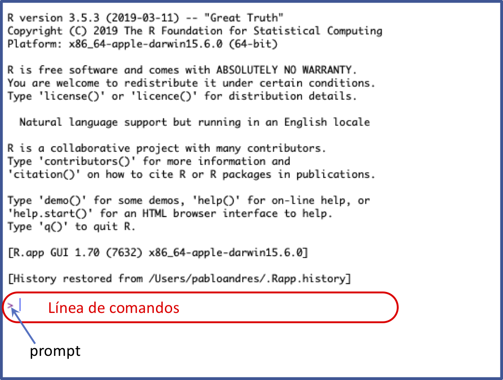
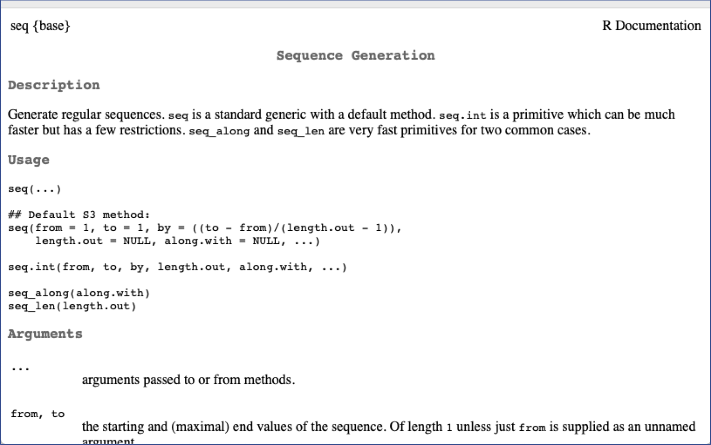
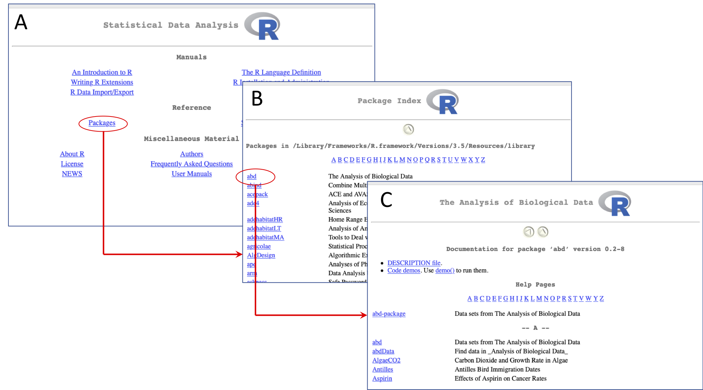

```{r setup, include=FALSE}
library(knitr)
opts_chunk$set(fig.align = 'center', warning = F, message = F, comment = NULL, prompt=TRUE)
```


***

En este material se revisan aspectos básicos sobre el software **R** tales como conocer sus ventanas, identificar el prompt y trabajar en la línea de comandos,  crear, manejar y guardar scripts básicos, establecer el director de trabajo, conocer el manejo de un comando, paquetes y su instalación, etc. 

***


## Ventanas de R: Consola y script

Cuando abriemos el **R** aparece una ventana llamada la **consola**. En esta ventana escribimos ordenes para **R** y se imprimen los resultados de tales ordenes. Enseguida se describen algunos aspectos relevantes del trabajo en la consola.

### Prompt y línea de comandos

El prompt (`>`) en la consola indica que el **R** esta listo para una nueva orden. El renglón cuyo inicio es marcado por el prompt se conoce como _línea de comandos_; en ella se escriben ordenes para **R**, y estas ordenes se ejecutan con un `enter` (Figura \@ref(fig:prompt)).

```{r prompt, echo = F, out.width='60%',  fig.cap='Consola del R mostrando el prompt (`>`) y la línea de comandos'}

```


Aquí un ejemplo del prompt con una orden para **R** en la línea de comandos:

```{r}
45 + 67/34   # calculo en la linea de comandos
```

El cuadro de bajo indica la impresión del resultado. El `[1]` que antecede el resultado indica la posición del resultado en la impresión. Así, el resultado `46.97059` esta en la posición nro. 1 de la impresión.  

Si al ejecutar una orden, la misma esta incompleta,  el **R** muestra un signo `+` en la siguiente línea indicando que falta algo de la orden anterior.

```{r, prompt = F, eval=F}
> 45 + 67/
+
```

Si se conoce la parte faltante para completar la orden se puede escribir luego del signo `+`:

```{r, eval=F, prompt=FALSE}
> 45 + 67/
+ 34
```

```{r, echo=FALSE}
45 + 67/34   # calculo en la linea de comandos
```

Si no se conoce lo que falta, se debe usar la tecla ESC para obligar al **R** a mostrar nuevamente el prompt, para después inciar la expresión desde el principio.

### Escribiendo en el script

El script es un archivo de texto plano (similar a word pero, no le pone formato al texto) donde se escriben las ordenes para **R** de forma más comada. Cuando se este seguro de las ordenes escritas se pueden enviar a la consola usando la combinación de teclas CTRL + R.

Es recomendable iniciar cualquier script con la fecha, un título corto sobre el contenido del script y el nombre del autor. Todo el texto que este a la derecha del signo `#` se deja como **comentario** y no se ejecuta.

```{r, eval=F, prompt = F}
# 17-jul-2019
# Ejemplo de un script
# Pablo A. Guzman

# Calculos
5 + 67/34    # calculo A
6 + 67/34    # calculo B
7 + 67/34    # calculo C
```


El archivo script se puede guardar con la extensión `.R` (recomendado) o con `.txt`.

## Comandos

Un comando es un objeto que realiza una tarea específica. Algunos ejemplos son:

- Comando `rep`:  repite un número o un conjunto de números cierta cantidad de veces. 
- Comando `seq`:  genera una secuencia de números. 
- Comando `sqrt`: saca la raíz cuadrada a un número.

### Sintaxis de un comando

Un comando en **R** tiene la siguiente forma:

```{r, eval = F, prompt = F}
nombre(arg1 = valor1, arg2 = valor2, arg3 = valor3)
```


donde la palabra `nombre` es el nombre del comando y dentro de los paretensis se encuentran los argumentos (`arg1`, `arg2`, etc.) del comando. Algunos ejemplos usando los comandos descritos arriba:

```{r}
rep(x = 4, times = 5)  # se repite el 4 cinco veces
seq(from = 4, to = 12, by = 2)  # secuencia desde 4 hasta 12 cada 2
sqrt(9)  # raiz cuadrada de 9
```

### Ayuda sobre comandos

Si sabemos el nombre de un comando podemos ir directamente a la archivo de ayuda del comando usando la sintaxis: `?nombre`, donde `nombre` es el nombre del comando. P.e.,

```{r}
?seq   # se solicita la ayuda del comando seq
```


```{r ayudaSeq, echo = F, out.width='60%',  fig.cap='Ayuda del comando `seq`'}

```

La figura \@ref(fig:ayudaSeq) muestra la ayuda del comando `seq`. Otra forma de solicitar ayuda es con el comando `help`:

```{r}
help(rep)   # solicitando ayuda sobre el comando 'rep'
```

Si no sabemos el nombre del comando, si no que queremos buscar en todo la ayuda, donde aparece cierta palabra usamos doble signo de interrogación de la siguiente forma:

```{r}
??average   # se busca entradas relacionadas con la palabra 'average'
```

### Orden de los argumentos

Los argumentos de un comando tienen un orden específico. Si se respeta el orden, se puede omitir el nombre del argumento y escribirse sólo su valor. P.e., el orden de los argumentos del comando `seq` son `from`, `to` y `by`. Si respetamos este orden podemos usar el comando de la siguiente forma:

```{r}
seq(4, 12, 2)  # uso de un comando sin nombres de argumentos
```

El orden se puede mantener parcialmente y en ese caso se pueden usar nombres para algunos argumentos y para otros no:

```{r}
seq(4, by = 2, to = 12)  # usando algunos argumentos con nombre y otros sin nombre
```

Podemos consultar los argumentos y su orden en la ayuda (sección: `arguments`) del comando:


```{r}
?seq  # abriendo la ayuda para ver los argumentos
```

## Paquetes o librerías

Un **paquete** (o librería) es un conjunto de comandos. Es decir los comandos se agrupan en paquetes. Cuando instalamos **R**, este ya viene con varios paquetes instalados tales como: `base`, `utils`, `stats`, `Matrix`, `Lattice`, etc. P.e., los comandos `seq`, `rep` y `sqrt` revisados atras son del paquete `base`. Sin embargo, en el CRAN (repositorios de **R**) existen más de 14000 paquetes disponibles.

Algunas necesidades relevantes con paquetes son las siguientes:

- Identificar el paquete al cual pertenece cierto comando. Esto se puede hacer consultando la ayuda del comando. En la esquina superior izquierda aparece el nombre del paquete entre llaves, vease la figura \@ref(fig:ayudaSeq).

- Identificar todos los comandos pertenecientes a cierto paquete: Consulte la ayuda del paquete. Para esto, siga la ruta: Menu Ayuda -> Ayuda HTML -> Paquetes -> Seleccione el paquete -> Lista de comandos. La Figura \@ref(fig:ayudaPaq) muestra esta ruta hasta seleccionar la lista de comandos del paquete `abd` [@middleton2015], este es un paquete con bases de datos del libro de @whitlock2015.

    ```{r ayudaPaq, echo = F, out.width='99%',  fig.cap='A. Página principal de la ayuda HTML. Se marca la opción _Packages_. B. Inicio de la página de la lista de paquetes luego de acceder por la opción _Packages_. Se selecciona el paquete `abd`. C. Lista de comandos del paquete `abd`. Este paquete no viene instalado con el **R**. Para instalación de paquetes vaya a [aquí](#instalPaq)'}

```


- Conocer cuales paquetes tenemos instalados. Siga la ruta Menu Paquetes -> Cargar paquete, esto le abre un cuadro de dialogo con los paquetes instalados. También, la siguiente expresión para **R** imprime en la consola los paquetes instalados:

    ```{r, results='hide'}
installed.packages()[, "Package"]  # Se imprimen todos los paquetes instalados
```

- Visitar el [CRAN](https://cran.r-project.org/web/packages/) (repositorios del **R**) para buscar paquetes: En el enlace <https://cran.r-project.org/web/packages/>. En esta página puede escoger consultar los paquetes en orden alfabetico o por fecha de publicación. P.e., seleccione por orden alfabetico. Cuando este en la página del listado de paquetes se recomienda usar el buscador de su explorador (se activa con las teclas CTRL + F) para buscar temas por alguna palabra clave. P.e., busque la palabra clave "genet" o "ecology" para ver que paquetes se relacionan con estos temas.

### Instalando paquetes {#instalPaq}

Para instalar un paquete se recomienda hacerlo desde **R** usando el comando `install.packages`. Suponga que se desea instalar el paquete `ape` [@paradis2018] el cual no viene instalado con el **R** y esta enfocado al análisis filogenético. Puede verificar que `ape` aparece en el [CRAN](https://cran.r-project.org/web/packages/). Para instalarlo, se escribe:

```{r,  eval = F}
install.packages('ape')  # Descarga e instalacion de paquete 'ape' y sus dependencias
```

La expresión anterior instala tanto el paquete de interés como los paquetes de los cuales depende. Usted puede consultar si el paquete en efecto se instaló usando alguno de los métodos revisados atras. También puede preguntar de forma específica si el paquete esta instalado usando la siguiente expresión:

```{r, prompt=T, eval = F}
# Se consulta si el paquete 'ape' esta instalado:
is.element(el = 'ape',  set = installed.packages()[, "Package"])
```

```{r, prompt=T, echo = F}
T
```


El resultado `TRUE` indica que el paquete `ape` si esta instalado.

### Activando paquetes

La orden anterior descarga e instala un paquete, pero no lo activa. Cuando un paquete se instala, permanece "apagado" o "escondido" y sus comandos no estarán disponibles hasta que se active o se prenda el paquete en una sesión específica. Para activar un paquete se usa el comando `library`:

```{r, eval = F, prompt=TRUE}
library(ape)  # se activa el paquete 'ape' luego de haberlo instalado
```

La instalación de un paquete sólo es necesario hacerla una vez, pero la activación del paquete se debe hacer cada vez que volvamos a abrir el **R** (y se requiera el paquete).


## Guardando o creando objetos

Para guardar información (datos) en un objeto usamos una flecha (`<-`) creada por la combinación de teclas menor que (`<`) y el guión medio (`-`). **Guardar** información en un objeto es lo mismo que **Crear** un objeto con "algo" a dentro. Aquí algunos ejemplos:

```{r, prompt=T}
x <- 45   # se guarda el 45 en x o se crea x con el nro. 45
w <- seq(4, 12, 2)  # se guarda el resultado del comando seq
z <- x^2    # se guarda el resultado de elevear al cuadrado el objeto 'x'
```

Notese que cuando se guarda o se crea un objeto, no se imprime por defecto en la consola el contenido del objeto. Para ver ese contenido, se debe ejecutar el nombre del objeto creado:

```{r, prompt=T}
x  # se ejecuta el objeto para imprimir su contenido
w  # se ejecuta el objeto para imprimir su contenido
```

La flecha (`<-`) indica que se esta **asignando** la información al objeto donde apunta la flecha. En este sentido, la flecha funciona en ambos sentidos. Así, las siguientes dos expresiones son equivalentes:

```{r, prompt=T}
w <- seq(4, 12, 2)
seq(4, 12, 2) -> w
```


## Ambiente de trabajo

El ambiente de trabajo (**environment** ó **workspace**) esta conformado por los objetos que el usuario crea o guarda en una sesión. P.e., en la sección anterior creamos tres objetos `x`, `w` y `z` de modo que estos tres objetos conforman nuestro ambiente de trabajo actual.

### Listar y borrar objetos del ambiente de trabajo {#borrarAmb}

Para imprimir los objetos que conforman el ambiente de trabajo usamos el comando `ls` sin argumentos:

```{r, prompt=T}
ls()   # imprimiendo los objetos del ambiente de trabajo
```

Para borrar objetos específicos del ambiente de trabajo, usamos el comado `rm`:

```{r, prompt=T}
rm(x)   # se remueve el objeto 'x' del ambiente de trabajo
```

Volvemos a preguntar por los objetos:

```{r, prompt=T}
ls()   # imprimiendo los objetos del ambiente de trabajo
```

y notamos que ya no aparece el objeto `x`. Para borrar todos los objetos de una sola vez usamos la siguiente la expresión: 

```{r, prompt=T}
rm(list = ls())   # imprimiendo los objetos del ambiente de trabajo
```

Observe ahora que no existe ningún objeto:

```{r, prompt=T}
ls()   # imprimiendo los objetos del ambiente de trabajo
```

El resultado `character(0)` indica que no existe ningún objeto en el ambiente de trabajo.

### Guardando el ambiente de trabajo

Para guardar en nuestro computador todo el ambiente de trabajo (es decir, todos los objetos que hemos creado) usamos el comando `save.image`. Enseguida creamos tres objetos (puesto que al final de la sección [anterior](#borrarAmb) borramos todo) y luego usamos `save.image` para guardarlos: 

```{r, prompt=T}
x <- 45   # se guarda el 45 en x o se crea x con el nro. 45
w <- seq(4, 12, 2)  # se guarda el resultado del comando seq
z <- x^2    # se guarda el resultado de elevear al cuadrado el objeto 'x'
save.image('mis_objetos.RData')  # se guarda el workspace (objetos creados en la sesion)
```

Lo anterior crea un archivo llamado `mis_objetos.RData` en una carpeta de nuestro computador conocida como el _directorio de trabajo_ (**working directory**). Cuando abrimos **R**, si no hacemos otra cosa, él mismo determina un _directorio de trabajo_. Para conocer el _directorio de trabajo_ actual se usa el comando `getwd`:

```{r, prompt=T, results='hide'}
getwd()   # Muestra cual es el directorio de trabajo actual
```

```{r, echo=F, prompt=T }
dir1 <- "/Users/pabloandres/Documents"
save.image(paste0(dir1,  '/mis_objetos.RData'))
dir1
```

Usted puede examinar el contenido de su directorio de trabajo usando el comando `dir` (ó el comando `list.files`):

```{r, echo=T, prompt=T, results='hide'}
dir()  # se examina el contenido del directorio de trabajo
```

```{r, echo=F }
dir(dir1)
```

Note que existen cuatro archivos en el directorio de trabajo y uno de ellos es `mis_objetos.RData`, este es el archivo guardado atras usando `save.image`.

### Cambiando el directorio de trabajo

El _directorio de trabajo_ (**working directory**) es una carpeta en el computador donde **R** guarda o lee archivos por defecto. Es muy importante conocer cuál es este directorio para poder gestionar los archivos asociados a nuestra sesión de trabajo con **R**. 

Al comienzo de toda sesión es recomendable establecer nuestro propio _directorio de trabajo_. Para hacer esto aplique los siguientes los pasos:

```{r, include = F}
dir2 <- paste0(dir1, '/prog')
if(!dir.exists(dir2)) dir.create(dir2) # se crea una carpeta 'prog'
```

1. Cree una carpeta en alguna ubicación de su computador. P.e., enseguida crearé una carpeta llamada `prog` en la ruta ``r dir1`` de mi computador. Usted debe buscar su propia ubicación para crear la carpeta `prog`.

2. En **R** use el comando `getwd` para establecer el directorio de trabajo a la carpeta creada en el paso (1):

    ```{r, eval=F}
setwd("/Users/pabloandres/Documents/prog")
```

    Lo anterior también se puede hacer de forma interactiva desde la consola de **R**, usando la opción `Cambiar dir ...` del Menu _File_ en Windows o del Menu _Misc_ en Mac.
    
3. Verifique con `getwd` que el _directorio de trabajo_ si halla cambiado:

    ```{r,  eval=F}
getwd()
```

    ```{r,  echo = F}
dir2
```

4. Ahora, cuando guarde un archivo desde **R**, este quedará en el nuevo _directorio de trabajo_. P.e., puede volver a usar `save.image` para guardar el ambiente de trabajo:

    ```{r,  eval = F}
save.image('mis_objetos.RData')
```

```{r,  include = F}
save.image(paste0(dir2, '/mis_objetos.RData'))
```

    y verificamos el contenido del nuevo directorio de trabajo con `dir`:
    
    ```{r,  eval = F}
dir()
```

    ```{r,  echo = F}
dir(dir2)
```

Note que ahora, el archivo `mis_objetos.RData` quedó guardado en el nuevo _directorio de trabajo_.

```{r, include = F}
# remocion de archivos y carpetas
file.remove(paste0(dir1, '/mis_objetos.RData'))
file.remove(paste0(dir2, '/mis_objetos.RData'))
file.remove(dir2)
```


## Referencias


