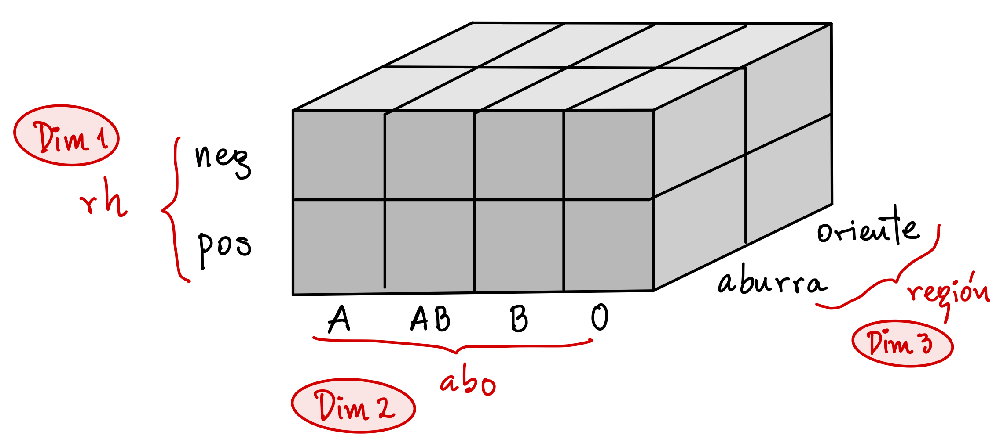
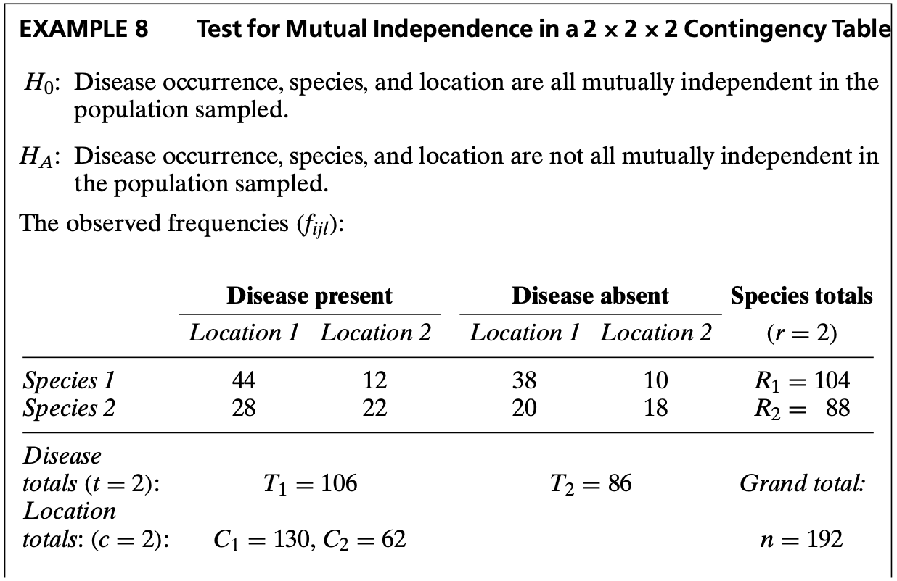

***
En este recurso revisaremos cuales son las diferentes formas de organización que pueden tener conjuntos de datos dominados por variables categóricas, como se visualizan en **R** y como podemos, a partir de dichos formatos, generar conteos o tablas de contingencia en **R**.

- [Datos de prueba](#datos)
- [Formatos de organización](#formatos)
- [Generando conteos y tablas de contigencia](#conteos)
- [Resumen de comandos](#resumen)
- [Ejercicios](#ejer)
- [Referencias](#ref)
- [Para saber más](#mas)

***


```{css estilos, echo = F}
.badCode {
background-color: LIGHTGOLDENRODYELLOW;
}
/* dos columnas */
.column-left{
  display: inline-block;
  width: 48%;
  text-align: left;
  vertical-align: middle;
}
.column-right{
  display: inline-block;
  width: 48%;
  text-align: left;
  vertical-align: middle;
}

div.csl-entry {
  line-height: 25px;   /* within paragraph */
  margin-bottom: 17px; /* between paragraphs */
}
```


```{r setup, include=FALSE}
library(knitr)
library(tidyverse)
library(checkdown)
library(details)
library(kableExtra)
#library(webexercises)
#library(shiny)
#library(webex)
#library(learnr)
opts_chunk$set(echo = TRUE, comment = NULL, warning = F, 
               message = F, fig.align = 'center',
               fig.width = 3.4, fig.height = 3)
```

```{r klippy, echo=FALSE, include=TRUE}
klippy::klippy(position = "right" )
```

```{r, include = F}
# Funcion para colorear texto a discrecion en Rmarkdown
# tomada de: https://stackoverflow.com/questions/29067541/how-to-change-the-font-color
colFmt = function(x,color){
  outputFormat = knitr::opts_knit$get("rmarkdown.pandoc.to")
  if(outputFormat == 'latex')
    paste("\\textcolor{",color,"}{",x,"}",sep="")
  else if(outputFormat == 'html')
    paste("<font color='",color,"'>",x,"</font>",sep="")
  else
    x
}
colblue <- function(x, color = 'blue') {
  colFmt(x = x, color = color)
}
```

```{r datos, include = F}
carmona <- read.csv(file = "datos/carmonaABO.csv")
plantas <- read.csv(file = "datos/rare_plants_agrup.txt", sep = "")
artritisFa <- read.csv(file = "datos/artritisFa.csv")
hh <-  c("Insomio","Ronquidos","Pesadillas",
         "Paralisis del sueno", "Hablar nocturno")
sueno <- data.frame(
  sexo = rep(c("fem","masc"), each = 5),
  trastorno = rep(hh, times = 2),
  n = c(31,29,25,9,2, 18,16,16,12,7)
)
```


## Datos de prueba {#datos}

### Tipos de Sangre

@carmona2006 reporta datos de tipos sanguíneos para una muestra de `r nrow(carmona)` trabajadores afiliados al Seguro Social en el valle de Aburrá y en el cercano oriente antioqueño. Su objetivo fue aportar al conocimiento de la distribución de los tipos sanguíneos en la región. Los datos se encuentran el archivo  [carmonaABO.csv](https://drive.google.com/file/d/10r4UN13WdXxcuvUNv7H5_c5ai0aYwolb/view?usp=sharing){target="Blank1"} en el cual cada fila es un sujeto y cada columna es una variable y las columnas están separadas por una coma. Importe los datos con el siguiente código:

```{r, eval = F}
carmona <- read.csv(file = "carmonaAB0.csv")   # se importan los datos
str(carmona)                                   # se imprime su estructura
```

```{r, echo = F}
str(carmona)
```

### Plantas raras

Un estudio citado por @gotelli2013 pretendió evaluar factores asociados con el estatus de conservación de `r sum(plantas$frequency)` poblaciones de plantas raras en Nueva Inglaterra. A cada población se le identificó si estaba declinando en tamaño y si estaba legalmente protegida entre otras variables. Los datos se encuentran en el archivo [rare_plants_agrup.txt](https://drive.google.com/file/d/1g23czchsOZgjNBX0Q5zW9wKoZBf1itQO/view?usp=sharing){target="Blank2"} donde cada columna es una variable y cada fila es una combinación de categorías de las variables observadas. Las columnas están separadas por un espacio sencillo.

```{r,  eval = F}
plantas <- read.csv(file = "rare_plants_agrup.txt", sep = "")   # se importa el archivo
str(plantas)                                                    # se imprime su estructura
```

```{r, echo = F}
str(plantas)   
```


## Formatos de organización {#formatos}

Un conjunto de datos con dominancia de variables categóricas puede presentarse bajo **tres** formatos de organización:

### Datos crudos

Donde cada fila es un sujeto (o un registro). De esta manera se encuentran los datos descargados del archivo `carmonaABO.csv`.

```{r}
head(carmona, 3)   # tres primeras filas del data.frame carmona
```

Observe que tenemos una columna que indica el sujeto. En este formato, la cantidad total de sujetos se corresponde con el número de filas de la tabla.

### Datos agrupados en formato largo

Donde cada fila es una **combinación de categorías** de las variables observadas. Debe existir una columna que indica la **frecuencia** de cada combinación. Los datos del archivo `rare_plants_agrup.txt` están bajo este formato:

```{r}
head(plantas, 3)   # tres primeras filas del data.frame plantas
```

Note que en este problema el "sujeto" es una población de plantas de modo que existen `r sum(plantas$frequency)` "sujetos" . Sin embargo, cada fila en la tabla `plantas`  no significa una población o "sujeto" si no una combinación de categorías de las variables observadas a cada población. La columna `frequency` representa la cantidad de "sujetos" o poblaciones con dicha combinación. Por ejemplo, de la 1era. fila concluimos que existen 2 poblaciones (de las `r sum(plantas$frequency)` en total) que tienen `decline = yes`; `invaded = no`; `protected = no` y `light = 0`. Así, la cantidad total de "sujetos" en este formato corresponde la suma de la columna de frecuencia.

### Datos agrupados en una tabla de contingencia

En este caso el conteo para cada combinación de categorías se organiza en una tabla de contingencia. Esta tabla puede ser **plana** como se muestra enseguida para los datos de carmona:

```{r, echo = F}
ftable(abo + rh ~ region , data = carmona)
```

Pero también puede ser una tabla de **mutiples dimensiones** (una dimensión por cada variable). Los datos de carmona tienen tres variables que generarían una tabla de contingencia de tres dimensiones, por ejemplo de 2 (rh) x 4 (abo) x 2 (regiones), como se observa enseguida:

<div class="column-left">
```{r, echo = F}
xtabs(~ rh + abo + region , data = carmona)
```
</div>
<div class="column-right">
```{r, echo = F, fig.width=6, fig.height=3.5}

```
</div>


## Generando conteos y tablas de contigencia {#conteos}

El análisis inicial con  variables categóricas es generar conteos (frec. absolutas) de sus categorías. Estos conteos se organizan tipicamente en tablas de contigencia (planas o multidimensionales). Algunos comandos de **R** que permiten hacer esto son `xtabs` y `ftable`.

```{r, echo = F, eval = F, include = F}
tibble(
  Comando = c("`table`", "`xtabs`", "`ftable`", "`count`", "`tabyl`"),
  Paquete = c("base", "stats", "stats", "dplyr", "janitor"),
  "Requiere instalación" = c("no", "no", "no", "si", "si"),
  Descripción = c(
    "Genera tablas de contingencia multidimensionales desde vectores o columnas de un data.frame. Requiere datos crudos. Entrega un objeto de clase `table`.",
    "Genera tablas de contingencia multidimensionales mediante la dupla de argumentos: `formula` y `data`. Requiere datos crudos o agrupados en formato largo. Entrega un objeto de clase `table`.",
    "Genera tablas de contingencia planas mediante la dupla de argumentos: `formula` y `data`. Requiere datos crudos o agrupados en tablas de contingencia. Entrega un objeto de clase `ftable`.",
    "Genera datos agrupados en formato largo desde datos crudos o agrupados en formato largo. Entrega un data.frame.",
    "Genera tablas de contingencia de hasta tres dimensiones desde datos crudos. Entrega un data.frame (para dos o una variable) o una lista (para tres variables). Para una sóla variable agrega una columna de porcentaje."
  )
) %>%
  kable() %>%
  kable_styling(full_width = F) %>%
  column_spec(4, width = "35em")
```

### Usando `xtabs`

El comando `xtabs` permite generar tablas de conteos de una o más dimensiones usando la dupla de argumentos `formula` y `data`. Aquí algunos ejemplos desde los  **datos crudos** del data.frame `carmona`:

```{r}
xtabs(~ region, data = carmona)             # tabla de conteos de una variable
xtabs(~ region + abo, data = carmona)       # tabla de conteos de dos variables
xtabs(~ rh + abo + region, data = carmona)  # tabla de conteos de tres variables
```

Desde datos **agrupados en formato largo** también se puede usar `xtabs`. Por ejemplo, una tabla de contigencia entre las variables `protected` y `decline` del data.frame `plantas` se obtiene como:

```{r}
xtabs(frequency ~ protected + decline, data = plantas)
```

En el comando `xtabs`, el orden de las variables ubicadas en la fórmula a la derecha de la virgulilla (`~`) equivale al orden en el cual se acomodarán las variables en las dimensiones del arreglo generado por `xtabs`. La 1era. variable en la fórmula se ubicará en al 1era. dimensión (filas), la 2da. variable en la fórmula quedará en la 2da. dimensión (columnas), y así sucesivamente.


### Usando `xtabs` y `as.data.frame`

El comando `as.data.frame` convierte el objeto que entrega `xtabs` en un data.frame con los datos agrupados en formato largo:

```{r}
f <-  xtabs(frequency ~ protected + decline, data = plantas)
as.data.frame(f)
```

Por defecto, el comando `as.data.frame` crea una columna llamada `Freq` con los conteos para cada combinación de categorías de las variables en la tabla de contigencia.


### Agregando totales marginales

El comando `addmargins` recibe el objeto que entrega `xtabs` y adiciona totales en las margenes^[En estadística, a estos totales en las margenes se les llama la **distribución marginal** de la variable en cada margen (o dimensión) de la tabla] de la tabla:

```{r}
f <- xtabs(~ region, data = carmona)      # tabla de conteos de una variable
addmargins(f)   # agregando totales en las margenes

f <- xtabs(~ rh + abo, data = carmona)    # tabla de conteos de dos variables
addmargins(f)   # agregando totales en las margenes
```

### Calculando proporciones

El comando `prop.table` recibe el objeto que entrega `xtabs` y convierte los conteos (frec. absolutas) en frecuencias relativas o proporciones:

```{r}
f <- xtabs(~ rh + abo, data = carmona)       # tabla de conteos de una variable
prop.table(f)    # calculando proporciones (divide por el gran total)
```

Por defecto el comando `prop.table` divide por el **gran total**. Sin embargo le podemos indicar que genere las proporciones **dividiendo por el total de filas**:

```{r}
prop.table(f, margin = 1)   # proporciones por el total de fila
```

O que produzca las proporciones **dividiendo por el total de columna**^[Cuando se divide por el total de fila o de columna estamos calculando una proporción **condicional**, es decir una proporción de la forma $p(\text{A dado B}) = p(A | B)$]:

```{r}
prop.table(f, margin = 2)   # proporciones por el total de columna
```

De manera opcional, use el comando `round` para redonder las proporciones a la cantidad de decimales deseada y puede multiplicar por 100 el objeto que entrega `prop.table` para ver los resultados como porcentajes.

## Usando `ftable`

El comando `ftable` produce tablas de contigencia **planas** desde un data.frame con datos crudos o desde objetos generados por el comando `xtabs`. En `ftable` también se utiliza la dupla de argumentos de `formula` y `data`, si embargo, la aplicación de la fórmula es diferente a `xtabs`. Considere el siguiente ejemplo:

```{r}
# Tabla de contingencia plana desde datos crudos:
ftable(abo ~ region + rh, data = carmona)
```

En la fórmula de `ftable`, las categorías de las variables ubicadas a la **izquierda** de la virgulilla (`~`) quedan en las **columnas** de la tabla de contingencia, mientras que las categorías de las variables a la **derecha** de la virgulilla (`~`) conformarán las **filas** de la tabla de contingencia.

El comando `ftable` también crea una tabla plana desde un objeto creado por `xtabs`, es decir, desde una tabla de múltiples dimensiones. Considere el siguiente ejemplo:

```{r}
# Se guarda tabla de tres dimensiones
f <- xtabs(~ rh + abo + region, data = carmona)   

# Se genera tabla de contingencia plana desde tabla de tres dimensiones
ftable(abo ~ region + rh, data = f)
```


## Resumen de comandos {#resumen}

La siguiente tabla presenta una lista de los comandos revisados arriba.


```{r, echo = F}
tibble(
  Comando = c("`xtabs`", "`ftable`", "`addmargins`", "`as.data.frame`"  , "`prop.table`"),
  Paquete = c("stats", "stats", "stats",  "base", "base"),
  "Requiere instalación" = c("no", "no", "no", "no", "no"),
  Descripción = c(
    "Genera tablas de contingencia multidimensionales mediante la dupla de argumentos: `formula` y `data`. Requiere datos crudos o agrupados en formato largo. Entrega un objeto de clase `table`.",
    "Genera tablas de contingencia planas mediante la dupla de argumentos: `formula` y `data`. Requiere datos crudos o agrupados en tablas multidimensionales. Entrega un objeto de clase `ftable`.",
    "Agrega totales en las margenes de una tabla multidimensional",
    "Convierte una tabla multidimensional en un data.frame con los datos agrupados en formato largo.",
    "Cálcula proporciones desde una tabla multidimensional. Puede usar como denominador el gran total, o el total de alguna de las dimensiones de la tabla."
  )
) %>%
  kable() %>%
  kable_styling(full_width = F) %>%
  column_spec(4, width = "35em")
```


## Ejercicios {#ejer}

1. Escriba código **R** que le permita, a partir de los datos del data.frame `carmona`:

    (a) generar una tabla de conteos de la `region` (filas) contra el `rh` (columnas)
    (b) convertir la tabla generada en (a) en una de proporciones donde el divisor sea el total por `region`.

2. Escriba código **R** que le permita, a partir del data.frame `plantas`: 

    (a) Crear una arreglo de conteos de tres dimensiones con las siguientes variables: `invaded`, `decline` y `protected` en dicho orden.
    (b) Convertir el arreglo obtenido en (a) en datos agrupados en formato largo.
    (c) Exportar los datos generados en (b) a un archivo separado por comas.
    

3. El archivo [artritisFa.csv](https://drive.google.com/file/d/1U3qWwRFWK6HhSzn0yfj5fdY0rZygzqJW/view?usp=sharing){target="Blank3"} contiene los datos de un ensayo clínico donde participaron un total de `r sum(artritisFa$n)` sujetos. En el ensayo se comparó un tratamiento contra la artritis con un placebo. La respuesta o desenlace es una variable categórica ordinal llamada `Improved` ("mejora"). Se cuenta, además, con la edad y el género. Los datos están **agrupados en formato largo**. Importe el archivo a **R** y realice las siguientes actividades:

    (a) Realiza una tabla de contingencia de dos dimensiones que compare las categorías de la respuesta entre los dos tratamientos. ¿Cuántos sujetos mostraron una ninguna mejora y estuvieron en el grupo placebo?
    (b) Use la tabla generada en (a) para estimar la probabilidad de observar cada una de las categorías de la respuesta _condicionado_ al tratamiento. ¿\,Existe mayor probabilidad de presentar una mejora _marcada_ si se es tratado que si no\,? Explique.

4. @garcia2015  reportan una tabla de contigencia que relaciona los tipos de transtornos del sueño y el género en  `r sum(sueno$n)` estudiantes de medicina. Vaya a la [Tabla 2 del artículo](http://scielo.sld.cu/scielo.php?script=sci_arttext&pid=S1029-30192015000800007){target="Blank4"} y escriba código **R** que le permita digitar los datos en dicha tabla de manera **agrupado en formato largo**. Luego use el comando `xtabs` para crear la tabla mostrada en el artículo.


## Referencias {#ref}

<div id="refs"></div>

<br>
<br>

## Para saber más {#mas}

### Filtrar antes de contar con `xtabs`

El comando `xtabs` tiene un tercer argumento, `subset`, que permite aplicar un **filtro lógico** a las filas del data.frame antes de realizar el conteo. Por ejemplo, considere el siguiente ejemplo:

```{r}
# Tabla de conteos entre 'protected' y 'decline' para cada nivel de 'invaded'.
# Resulta una tabla de tres dimensiones:
xtabs(frequency ~ protected + decline + invaded, data = plantas)
# Tabla de conteos entre 'protected' y 'decline' solo para el 
# nivel 'yes' de 'invaded'. Resulta una tabla de dos dimensiones:
xtabs(frequency ~ protected + decline, data = plantas, subset = invaded == "yes")
```

### Desde datos agrupados a datos crudos

Para convertir datos agrupados en formato largo a datos crudos podemos usar el comando `expand.dft` o `expand.table` (paquete: **vcdExtra**). En el ejemplo siguiente pasamos la tabla `plantas` a un data.frame como datos crudos:

```{r}
library(vcdExtra)   # se carga la libreria (debe verificar que la tenga instalada)
plantas0 <- expand.dft(x = plantas, freq = "frequency")   # se hace la conversion
str(plantas0)       # se observa la estructura de la nueva tabla para verificar
```

En el comando `expand.dft`, el argumento `freq` es una cadena de texto que indica el  nombre de la columna que contiene la frecuencia de cada fila en la tabla. Observe que en la nueva tabla `plantas0`, cada fila representa un "sujeto", en este caso, una población de plantas. ¿Porqué lo podemos saber?

El comando `expand.dft` también recibe una tabla de contingencia generada, por ejemplo, desde `xtabs`. Considere el siguiente ejemplo:

```{r}
f <- xtabs(~ rh + abo + region, data = carmona)  # tabla de contiengencia de tres dimensiones
carmona0 <- expand.dft(x = f)                    # se hace la conversion
str(carmona0)                                    # se revisa la estructura de la nueva tabla
```


### Entrando desde teclado una tabla de contingencia

Para digitar una tabla de contingencia directamente, entramos los conteos en una matriz o arreglo y asignamos nombres a cada categoría y variable usando el comando `matrix` (si hay una o dos variables) o el comando `array` (si hay más de dos variables).

**Ejemplo:**  Considere el siguiente ejemplo presentado por @zar2014

```{r, echo = F, fig.width=8, fig.height=5, out.width='60%'}

```

Suponga que usted quiere digitar la tabla de contingencia propuesta y convertir los datos a un formato crudo. El siguiente código permite realizar la entrada:

```{r}
# Entrando tabla de contingencia de 2 x 2 x 2 desde teclado:
zar8 <- array(
  data = c(44,28,12,22, 38,20,10,18), 
  dim  = c(2,2,2), 
  dimnames = list(
    sp      = c("sp1", "sp2"),
    loc     = c("loc1", "loc2"),
    disease = c("present", "absent")
  )
)

# Se asigna la clase `table` al arreglo creado
zar8 <- as.table(zar8)
```

El último paso donde se actualiza la clase del arreglo creado es importante para garantizar que otros comandos que operan sobre objetos de clase `table` o `xtabs` pueden funcionar. Ahora imprimamos la tabla o arreglo para verificar la digitación:

```{r}
addmargins(zar8, margin = 1:2)
```


### Reordenando o colapsando dimensiones

Çonsidere la tabla (o arreglo) de contingencia `zar8` de tres dimensiones, 2 x 2 x 2, creada en la sección anterior. Suponga que quisieramos colapsar la tabla `zar8` para explorar sólo la relación entre la especie y la enfermedad. Para esto usamos el comando `margin.table`:

```{r}
# Colapsando (sumando) categorias de la variable en la dimension 2
zar8.sp.d <- margin.table(x = zar8, margin = c(1,3))
zar8.sp.d
```

El argumento `margin` del comando `margin.table` permite indicar cuales dimensiones se quiere que permanezcan. Aquellas dimensiones ausentes en este argumento serán colapsadas (sumadas) y desaparecerán en el arreglo resultante.

Al argumento `margin` también le podemos indicar todas las dimensiones, pero en **nuevo orden**. En este caso, el arreglo resultante tendrá dicho nuevo orden en sus dimensiones:

```{r}
# Cambiando el orden de las dimensiones del arreglo original
# La variable en la dimension 3 se pasa a la dimension 2 y viceversa
zar8r <- margin.table(x = zar8, margin = c(1,3,2))
zar8r
```


