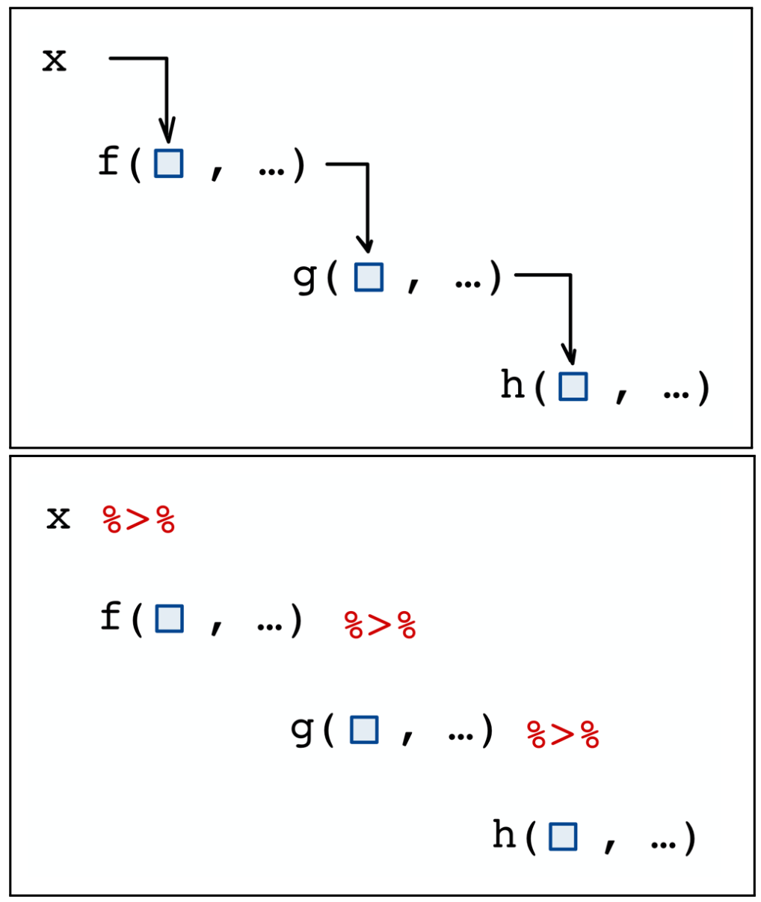

```{css, echo = F}
.badCode {
background-color: LIGHTGOLDENRODYELLOW;
}
/* dos columnas */
.column-left{
  display: inline-block;
  width: 48%;
  text-align: left;
  vertical-align: middle;
}
.column-right{
  display: inline-block;
  width: 48%;
  text-align: left;
  vertical-align: middle;
}

pre code, pre, code {
  white-space: pre !important;
  overflow-x: scroll !important;
  word-break: keep-all !important;
  word-wrap: initial !important;
}
```

```{r setup, include=FALSE}
library(knitr)
library(tidyverse)
library(checkdown)
library(details)
library(webexercises)
library(wakefield)
library(randomNames)
library(kableExtra)
#library(learnr)
opts_chunk$set(echo = TRUE, comment = NULL, warning = F, 
               message = F, fig.align = 'center', class.output="badCode",
               fig.width = 3.4, fig.height = 3)
```

```{r colFmt, include = F}
# Funcion para colorear texto a discrecion en Rmarkdown
# tomada de: https://stackoverflow.com/questions/29067541/how-to-change-the-font-color
colFmt = function(x,color){
  outputFormat = knitr::opts_knit$get("rmarkdown.pandoc.to")
  if(outputFormat == 'latex')
    paste("\\textcolor{",color,"}{",x,"}",sep="")
  else if(outputFormat == 'html')
    paste("<font color='",color,"'>",x,"</font>",sep="")
  else
    x
}
colpkg <- function(x) colFmt(x = x, color = "goldenrod")
```


```{r klippy, echo=FALSE, include=TRUE}
klippy::klippy(position = "right")
```

```{r, echo = F}
rintimg::img_intensify()
```


***
En el trabajo con variables categóricas es importante poder manipular las etiquetas de las categorías o niveles de la variable. A propóstio de esto, en esta sesión aprenderemos a:

- categorizar una variable numérica
- cambiar las etiquetas de los niveles en un factor
- cambiar el orden de los niveles en un factor
- reagrupar los niveles de un factor
- usar lo anterior para apoyar el diseño de gráficos

Para la mayoría de actividades usaremos comandos de **forcats** un paquete del **tidyverse** especializado en manipular factores.

***

```{r datos, include = F}
dat <- read.csv(file = "datos/tratSimul.csv")
```

## Paquetes y comandos

En este recurso usaremos el **tidyverse**, principalmente el comando `mutate` (del paquete **dplyr**) y algunos comandos del paquete **forcats**. También, de este mismo grupo de paquetes, aplicaremos el operador `%>%` ("pipe") para encadenar comandos. Para activar los paquetes del **tidyverse** utilice el siguiente código: `library(tidyverse)`.


### Operador "pipe" (`%>%`)

Este operador permite pasar el objeto que esta a su izquierda como **primer** argumento del comando que está a su derecha, y con esto, favorece la escritura de código donde se deben usar varios comandos, uno detras de otro, para transformar un objeto.

<div class="column-left">
El operador `%>%` pasa el objeto a su izquierda como primer argumento del comando a su derecha. Es decir, el código:

<center>
`f(x,y)`
</center>


es equivalente a

<center>
`x %>% f(y)`
</center>

</div>
<div class="column-right">
```{r, echo = F, fig.width=3, fig.height=4.5, out.width="60%"}

```
</div>


### Comandos del paquete `forcats`

La mayoría de comandos del paquete **forcats** inician con el prefijo `fct_`, todos ellos diseñados para realizar operaciones de rutina con variables categóricas o factores. Algunos comandos son:

```{r, echo = F}
tibble(
 Comando = c("`fct_relevel`", "`fct_recode`", "`fct_rev`", 
             "`fct_infreq`", "`fct_inorder`", "`fct_reorder`" ),
 Descripción = c("Permite reordenar los niveles de un factor usando diferentes alernativas",
                 "Permite cambiar las etiquetas o reagrupar los niveles del factor",
                 "Invierte el orden los niveles de un factor",
                 "Ordena los niveles de un factor de acuerdo a su frecuencia en el vector",
                 "Ordena los niveles de un factor de acuerdo al orden en el que aparezcan en el vector",
                 "Ordena los niveles de un factor de acuerdo a valores de una variable numérica resumida por funciones como la media o mediana")
) %>%
  kable() %>%
  kable_styling(full_width  = F) %>%
  column_spec(2, width = "35em")
```


Descargue una hoja de referencia del paquete **forcats** [aquí](cheat_sheet_forcats.pdf){target="Blank"}.


## Datos de prueba {#datos}

El archivo [tratSimul.csv](datos/tratSimul.csv) contiene los datos de un estudio donde participaron `r nrow(dat)` sujetos. En el ensayo se comparó un tratamiento para mejorar los sintomas de cierta enfermedad contra un placebo. La respuesta o desenlace fue una variable categórica ordinal llamada `Improved` ("mejora"). Se cuenta, además, con la edad y el género de los sujetos. Importe los datos con el siguiente código:

```{r, eval = F}
dat <- read.csv(file = "tratSimul.csv")   # se importan los datos
str(dat)                                  # se imprime su estructura
```

```{r, echo = F}
str(dat)
```

Una tabla de contingencia plana de estos datos es la siguiente:

```{r}
ftable(Improved ~ Sex + Treatment, data = dat)
```

Un resumen de la edad es el siguiente:

```{r}
summary(dat$Age)
```

<br>

## Transformando variables {#transf}

### Categorizando una variable numérica {#categ-num}

En una copia del data.frame `dat`, cree o agregue una nueva variable llamada `AgeF` que tenga la edad (`Age`) convertida en una variable categórica con tres niveles. Cuando imprima el `str` de la nueva tabla debe salir algo como lo siguiente:

```{r, include = F}
# Se crea una nueva tabla (dat1) con una variable nueva (AgeF)
dat1 <- dat %>%
  mutate(
    AgeF = cut(Age, br = c(20,40,60,80), labels = c("Jov","Med","Viej"))
  )
```

```{r}
str(dat1)  # estructura de la nueva tabla
```

<br>

Use el comando `cut` (dentro del comando `mutate`) para realizar la categorización y simultaneamente agregar la nueva variable. Asigne etiquetas pertinentes a los niveles de `AgeF`. Finalice escribiendo código **R** que le permita verificar la transformación. 

:::: {.orangebox data-latex=""}

**Código solución**

```{r, results = "hide", class.source = "fold-hide"}
# Se crea una nueva tabla (dat1) con una variable nueva (AgeF)
dat1 <- dat %>%
  mutate(
    AgeF = cut(Age, br = c(20,40,60,80), labels = c("Jov","Med","Viej"))
  )
str(dat1)  # estructura de la nueva tabla

# Verificando la categorizacion:
head(dat1, 3)  # 1eras. tres filas de la nueva tabla

# Resumen por grupo:
dat1 %>%                 # con la nueva tabla 
  group_by(AgeF) %>%     # agrupo por AgeF
  summarise(             # y resumo para calcular ...
    n = n(),             # la cantidad de filas (sujetos),
    Age_min = min(Age),  # la edad min y,
    Age_max = max(Age)   # la edad max por grupo
  )
```

::::

<br>

### Re-ordenando los niveles de un factor {#reordenar}

Cuando **R** crea un factor, a no ser de que se indique otra cosa, los niveles del factor quedan ordenados de menor a mayor alfabeticamente. El orden de los niveles de un factor se puede consultar usando el comando `levels`. Por ejemplo, para la respuesta `Improved`, el orden actual de sus niveles es:

```{r}
dat %>%               # desde dat ...
  pull(Improved) %>%  # se extrae Improved
  factor() %>%        # se convierte en factor
  levels()            # se consultan los niveles del factor y su orden
```

En la copia de la tabla creada para el ejercicio anterior, actualice la columna `Improved` cambiando el orden de los niveles de esta variable de tal forma que el nuevo orden sea: `None`, `Low`, `Medium` y `High`. Para esto utilice el comando `fct_relevel` en conjunto con `mutate`. Finalice escribiendo código que verifique la transfromación.

:::: {.orangebox data-latex=""}

**Código solución**

```{r, results = "hide", class.source = "fold-hide"}
# Se actualiza la columna Improved cambiando el orden sus niveles.
dat1 <- dat1 %>%
  mutate(
    Improved = fct_relevel(Improved, "None", "Low", "Medium")
  )
str(dat1)  # estructura de la nueva tabla

# Se verifica el cambio
levels(dat1$Improved)

# Por ejemplo, en una nueva tabla de contingencia
# los niveles ya salen ordenados:
xtabs(~ Treatment + Improved, data = dat1) %>%
  prop.table(margin = 1) %>%
  round(3)
```

::::

<br>


### Re-etiquetando los niveles de un factor {#reetiq}

En la misma copia de la tabla creada en el primer ejercicio, cree nuevas variables en las cuales se cambie las etiquetas de las categorías de las variables `Treatment`, `Sex` e `Improved` por unas en español. Para esto utilice el comando `fct_recode` en conjunto con `mutate`. Finalice escribiendo código que verifique la transfromación.

:::: {.orangebox data-latex=""}

**Código solución**

```{r, results = "hide", class.source = "fold-hide"}
# Se crean nuevas variables, versiones en espanol, de las variables Improved, Sex y Treatment.
# Al usar el comando fct_recode la clave esta en la sintaxis: etiqueta_nueva = "etiqueta_actual"
dat1 <- dat1 %>%
  mutate(
    Mejora = fct_recode(Improved, Ninguna = "None", Baja = "Low", 
                          Media = "Medium", Alta = "High"),
    trat   = fct_recode(Treatment, Placebo = "Placebo", Tratado = "Treated"),
    genero = fct_recode(Sex, Hombre = "Male", Mujer = "Female")
  )
str(dat1)  # estructura de la nueva tabla

# Se verifica el cambio
levels(dat1$Improved)

# Se realizan tablas de contingencia para verificar el cambio
xtabs(~ Treatment + trat, data = dat1)
xtabs(~ Improved + Mejora, data = dat1)
xtabs(~ Sex + genero, data = dat1)
```

::::

<br>


### Re-categorizar los niveles de un factor {#recateg}

Aquí nos referimos a cambiar el agrupamiento de los niveles de un factor generando nuevos (menos) niveles. En la misma copia de la tabla creada desde el primer ejercicio, agregue una nueva variable llamada `Mejora3` en la cual los niveles `Media` y `Alta` conformen un sólo nivel etiquetado como `Marcada`. Utilice para esto, de nuevo, el comando `fct_recode` dentro del comando `mutate`. Termine escribiendo código **R** que permita verificar el cambio.

:::: {.orangebox data-latex=""}

**Código solución**

```{r, results = "hide", class.source = "fold-hide"}
# A partir de la variable Mejora, se crea nueva variable uniendo dos categorias
# (re-categorizando). Al usar el comando fct_recode, la clave esta en usar 
# la misma (nueva) etiqueta para todos los niveles que se quieren juntar.
dat1 <- dat1 %>%
  mutate(
    Mejora3 = fct_recode(Mejora, Marcada = "Media", Marcada = "Alta")
  )
str(dat1)  # estructura de la nueva tabla

# Se verifica el cambio
levels(dat1$Mejora3)

# Se realizan tablas de contingencia para verificar el cambio
xtabs(~ Mejora, data = dat1)
xtabs(~ Mejora + Mejora3, data = dat1)
```

::::

<br>


## Aplicación de `forcats` al generar gráficos {#graf}

Considere el siguiente gráfico que muestra la frecuencia de sujetos en cada categoría de la respuesta (`Mejora`) de acuerdo al tratamiento, el género y la edad.

```{r, fig.width=5, fig.height=4, echo = F}
dat1 %>%
  xtabs(~ trat + Mejora + AgeF + genero, data = .) %>%
  prop.table(margin = c(1,3,4)) %>%
  as.data.frame() %>%
  mutate(
    Mejora  = fct_rev(Mejora)    # se revierte el orden de los niveles para queden 
                                 # mejor en el grafico
  ) %>%
  ggplot(aes(x = AgeF, y = Freq*100, fill = Mejora)) + geom_col() +
  facet_grid(genero ~ trat) +
  scale_fill_brewer(direction = -1, palette = "YlGn") +
  labs(x = "Edad", y = "Frecuencia (%)", fill = "Mejora de\nsíntomas")
```

- De acuerdo al gráfico ¿concluiría que el tratamiento si parece estar asociado con una mejora en los síntomas de la enfermedad? De existir un efecto del tratamiento, este sería el mismo en todos los grupos de edad?

- Escriba código **R** que produzca el gráfico. Para esto, use `xtabs`, `prop.table` y `as.data.frame` para generar un data.frame con las frecuencias relativas condicionadas a cada grupo. Luego use `ggplot` con `geom_col` (o uno similar) para realizar el gráfico. 


:::: {.orangebox data-latex=""}

**Código solución**

```{r, fig.show='hide', class.source = "fold-hide"}
# Creacion de data.frame con datos agrupados en formato largo
# y generacion de grafico de barras apiladas con ggplot2
dat1 %>%
  xtabs(~ trat + Mejora + AgeF + genero, data = .) %>%
  prop.table(margin = c(1,3,4)) %>%
  as.data.frame() %>%
  mutate(
    Mejora  = fct_rev(Mejora)    # se revierte el orden de los niveles para que queden 
                                 # mejor en el grafico de acuerdo a la escala de color
  ) %>%
  ggplot(aes(x = AgeF, y = Freq*100, fill = Mejora)) + geom_col() +
  facet_grid(genero ~ trat) +
  scale_fill_brewer(direction = -1, palette = "YlGn") +
  labs(x = "Edad", y = "Frecuencia (%)", fill = "Mejora de\nsíntomas")
```

::::

<br>

## Para saber más

### Ordenando niveles por su frecuencia

Considere el data.frame `DAAG::ais`  que tiene datos sobre variables morfométricas y de la sangre de una muestra de `r nrow(DAAG::ais)` atletas en `r length(unique(DAAG::ais$sport))` deportes.

```{r}
library(DAAG)   # se carga paquete DAAG
str(ais)        # se revisa la estructura del data.frame "ais"
```

Suponga que se quiere hacer un diagrama de barras del factor `sport` para mostrar la frecuencia de cada deporte, una opción sería el siguiente código:

```{r, fig.width=3.5, fig.height=2.9}
# Codigo para realizar diagrama de barras de frecuencias del factor 'sport'
ais %>%
  xtabs(~ sport, data = .) %>%
  as.data.frame() %>%
  ggplot(aes(x = Freq, y = sport)) + geom_col(fill = "skyblue")
```

No obstante, el gráfico queda mucho mejor si los deportes se muestran ordenados por su frecuencia. El comando `fct_infreq` realiza esta ordenación automáticamente:

```{r, fig.width=3.5, fig.height=2.9}
# Codigo para realizar diagrama de barras de frecuencias del factor 'sport'
# antes se reordenan los niveles del factor 'sport' por la frecuencia
ais %>%
  mutate(
    sport = fct_infreq(sport)
  ) %>%
  xtabs(~ sport, data = .) %>%
  as.data.frame() %>%
  ggplot(aes(x = Freq, y = sport)) + geom_col(fill = "skyblue")
```

> **Nota:** El comando `count` (paquete **dplyr**) produce los conteos igual que `xtabs` pero directamente en un `data.frame` como datos agrupados en formato largo. Es decir, con este comando nos ahorramos la aplicación de `as.data.frame`. El código sería el siguiente:

```{r, eval = F}
# Codigo para generar el mismo grafico de arriba sólo aque ahora usamos
# el comando 'count' para generar el data.frame con los conteos.
ais %>%
  mutate(
    sport = fct_infreq(sport)
  ) %>%
  count(sport) %>%
  ggplot(aes(x = n, y = sport)) + geom_col(fill = "skyblue")
```
    

### Ordenando niveles de un factor por una variable numérica

Considere este gráfico donde se realizan boxplot de la `hg` (hemoglobina) por deporte:

```{r, fig.width=3.5, fig.height=2.9}
ggplot(ais, aes(x = hg, y = sport)) + 
  geom_boxplot(fill = "skyblue")
```

El gráfico puede mejorar si los deportes se ordenan por su nivel de hemoglobina. Para hacer esto, usamos el comando `fct_reorder`, el cual permite ordenar por alguna medida de resumen, tal como la mediana o la media, calculada a cierta variable numérica por grupo:


```{r, fig.width=3.5, fig.height=2.9}
ggplot(ais, aes(x = hg, y = fct_reorder(sport, hg, median))) + 
  geom_boxplot(fill = "skyblue") +
  geom_vline(xintercept = median(ais$hg), size = 0.5, linetype = "dashed") +
  labs(y = "Sport")
```


