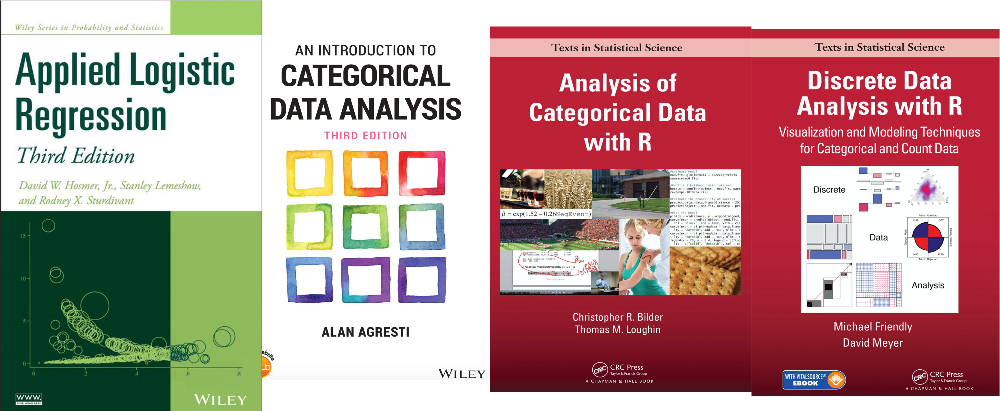
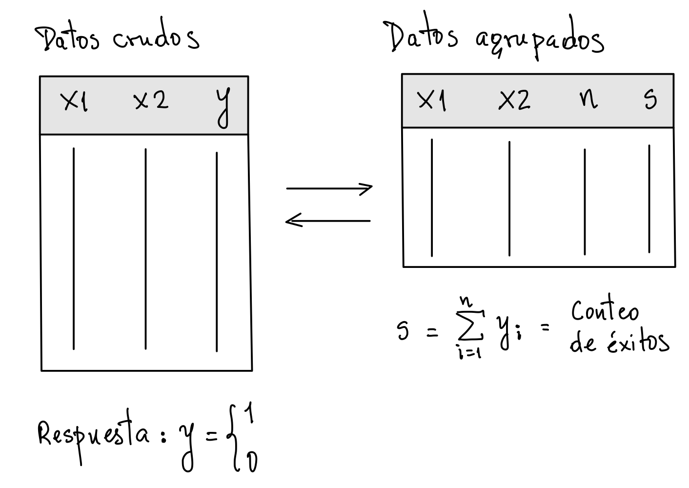

```{css, echo = F}
.badCode {
background-color: LIGHTGOLDENRODYELLOW;
}
/* dos columnas */
.column-left{
  display: inline-block;
  width: 48%;
  text-align: left;
  vertical-align: middle;
}
.column-right{
  display: inline-block;
  width: 48%;
  text-align: left;
  vertical-align: middle;
}

pre code, pre, code {
  white-space: pre !important;
  overflow-x: scroll !important;
  word-break: keep-all !important;
  word-wrap: initial !important;
}

div.csl-entry {
  line-height: 25px;   /* within paragraph */
  margin-bottom: 17px; /* between paragraphs */
}
```

```{r setup, include=FALSE}
library(knitr)
library(tidyverse)
library(checkdown)
library(details)
library(wakefield)
library(randomNames)
library(kableExtra)
#library(learnr)
opts_chunk$set(echo = TRUE, comment = NULL, warning = F, 
               message = F, fig.align = 'center', class.output="badCode",
               fig.width = 3.4, fig.height = 3)
```

```{r colFmt, include = F}
# Funcion para colorear texto a discrecion en Rmarkdown
# tomada de: https://stackoverflow.com/questions/29067541/how-to-change-the-font-color
colFmt = function(x,color){
  outputFormat = knitr::opts_knit$get("rmarkdown.pandoc.to")
  if(outputFormat == 'latex')
    paste("\\textcolor{",color,"}{",x,"}",sep="")
  else if(outputFormat == 'html')
    paste("<font color='",color,"'>",x,"</font>",sep="")
  else
    x
}
colpkg <- function(x) colFmt(x = x, color = "goldenrod")
```


```{r klippy, echo=FALSE, include=TRUE}
klippy::klippy(position = "right")
```

```{r, echo = F, eval = F}
rintimg::img_intensify(target = ".png")  # para hacer zoom en imagenes
# Nota: el problema con esto es que tambien incluye la imagen del icono
# que pone el paquete klippy en la esquina superior de los chunk's de codigo
# entonces cuando se hace clic en este icono para copiar el codigo
# se agranda la imagen del codigo y esto es molesto.
```


***
La regresión logística permite evaluar el efecto de una o más predictoras sobre una respuesta binaria tal como la germinación/no, la presencia/ausencia de cierta especie en un hábitat, la muerte/sobrevivencia, la presencia/ausencia de enfermedad, etc. 

La regresión logística es una de las técnicas más utilizadas en análisis de datos. Puede usarse con propósitos predictivos, para probar hipótesis en escenarios experimentales u observacionales desde múltiples diseños de muestreo, o también para clasificación. En este recurso revisaremos como ajustar un modelo de regresión logística simple en **R**. Aspectos más avanzados se dejan en el anexo.

***

<br>

## Libros recomendados

<br>

```{r, echo = F, fig.width=8, fig.height=3, out.width="90%"}

```

<br>

- Hosmer Jr, D. W., Lemeshow, S., & Sturdivant, R. X. (2013). Applied logistic regression. 3ed. John Wiley & Sons

- Agresti, A. (2018). An introduction to categorical data analysis. 3ed. John Wiley & Sons

- Bilder, C. R., & Loughin, T. M. (2014). Analysis of categorical data with R. CRC Press.

- Friendly, M., & Meyer, D. (2015). Discrete data analysis with R: visualization and modeling techniques for categorical and count data. CRC Press

<br>

## Librerías

```{r}
# Librerias obligatorias para la sesion
library(tidyverse)   # para ggplot2, tibble, dplyr, etc.  
```

<br>

```{r}
# Librerias recomendadas en el contexto de datos categoricos 
# y Regresion logistica. No se usaran en la sesion (algunas si en los anexos)

library(car)         # Para comando Anova (prebas LRT tipo 2 o tipo III) entre otras cosas
library(emmeans)     # Para solicitar predicciones y contrastes desde el modelo (muy buena !!!)
library(vcd)         # Visualizacion de datos categoricos (del libro de Friendly & Meyer)
library(pROC)        # Realiza curva ROC y calcula Areas bajo la curva (AUC)
```

<br>
<br>

## Modelo de regresión logística

La regresión logística (RL) permite modelar una variable respuesta binaria en función de una o más predictoras, las cuales pueden ser continuas, categóricas o una mezcla de ambos tipos. 

Suponga que $Y$ es la respuesta binaria, p.e., si un insecto muere/sobrevive cuando se expone a cierto tóxico. En símbolos:

$$Y = \left \lbrace \begin{array}{ll}1 & \text{si muere}  \\[1ex] 0 & \text{si sobrevive} \end{array} \right.$$

Si $\pi = P(Y = 1)$ es la probabilidad de que la respuesta $Y$ resulte en el evento de interés (muerte del insecto en el caso del ejemplo), entonces el modelo de RL es [@bilder2015]:

\begin{equation}
(\#eq:rl0)
\log{\left(\dfrac{\pi}{1-\pi}\right)} = \beta_0 + \beta_1x_1 + \beta_2x_2 + \cdots + \beta_px_p
\end{equation}

donde $x_1, x_2, \ldots, x_p$ son las variables predictoras y $\beta_0, \beta_1, \beta_2, \ldots, \beta_p$ son los coeficientes (parámetros) del modelo. Algunos comentarios sobre el modelo \@ref(eq:rl0) son:

- La cantidad $\pi / (1- \pi)$ es una medida alternativa de probabilidad que recibe el nombre de `odds`. P.e., si la probabilidad de germinación fuera $\pi = 0.75$, el `odds` de germinar sería $0.75/0.25 = 3$. Esto indica hay un `odds` de 3 a 1 de que la semilla germine.

- El logaritmo (natural) del `odds` es llamado `logit`. P.e., si la probabilidad de germinar fuera $\pi = 0.75$, entonces `logit` = $\log{(0.75/0.25)} = \log{(3)} = 1.099$.

- Algunas de las predictoras ($x_j$) pueden estar basadas en otras. P.e., quizas $x_3 = x_1x_2$ para permitir interacción entre $x_1$ y $x_2$ en sus efectos sobre $Y$, o quizas $x_3 = x_1^2$ para permitir un efecto curvilineo de $x_1$ sobre $Y$.

- Los coeficientes $\beta_1, \beta_2, \ldots, \beta_p$ representan el cambio (pendiente) en el `logit` cuando la correspondiente predictora $x_j$ aumenta una unidad y las otras predictoras permanecen constantes. Cuando estos coeficientes se les toma la exponencial (es decir, $e^{\beta_j}$), representan **razones de odds** (OR) asociadas al incremento en una unidad de la predictora correspondiente y manteniendo constantes las demás. Esta interpretación puede variar dependiendo de si existen términos de interacción o polinómicos con algunas predictoras [@bilder2015].

<br>

Continuando con el ejemplo, suponga que interesa evaluar el efecto de la concentración ($x$) de cierto insecticida sobre la muerte de una especie de insecto. El modelo de RL dado en \@ref(eq:rl0) quedaría como:

\begin{equation}
(\#eq:rl1)
\log{\left(\dfrac{\pi}{1-\pi}\right)} = \beta_0 + \beta_1x
\end{equation}

donde $\pi$ es la tasa (probabilidad) de mortalidad y $x$ es la concentración del insecticida.

Observe que el modelo \@ref(eq:rl1) propone que la relación entre el `logit` = $\log{(\pi / (1-\pi))}$ de la mortalidad y la concentración del insecticida ($x$) es una línea recta. Sin embargo, la relación entre $\pi$ y la concentración del insecticida ($x$) es una curva logística dada por:

\begin{equation}
(\#eq:rl2)
\pi = \dfrac{e^{\beta_0 + \beta_1x}}{1 + e^{\beta_0 + \beta_1x}}  = \dfrac{1}{1 + e^{-(\beta_0 + \beta_1x)}}
\end{equation}

La ecuación \@ref(eq:rl2) se obtiene despejando $\pi$ del modelo \@ref(eq:rl1). La figura siguiente presenta las gráficas del `logit` en el modelo \@ref(eq:rl1) y de $\pi$ en el modelo \@ref(eq:rl2).


```{r, fig.width=6, fig.height=2.9,  class.source = "fold-hide", fig.cap = "Gráficos de los modelos \\@ref(eq:rl1) (izquierda) y \\@ref(eq:rl2) (derecha) cuando $\\beta_1 > 0$"}
# Funciones a graficar
logit <- function(x, b0, b1) b0 + b1*x
prob  <- function(x, b0, b1) {
  logit <-  b0 + b1*x
  1 / (1 + exp(-logit))
}

# Parametros de ejemplo
p0 <- 0.1                  # valor de prob cuando x = 0
b0 <- log( p0 / (1-p0) )   # valor del logit cuando x = 0
x50 <- 8                   # valor de x al cual se alcanza prob = 0.5
b1 <- -b0 / x50            # pendiente del logit para b0 y x50

# Expresiones matematicas dentro de los graficos
e1 <- "logit == beta[0] + beta[1]*x"
e2 <- "pi == frac(1, 1 + e^{-(beta[0] + beta[1]*x)} )"
e3 <- expression(pi == P(Y == 1))

# Librerias
library(ggplot2)
library(cowplot)

# Graficos (una fila, dos columnas de graficos)
gg0 <- ggplot() + xlim(0,25)    # grafico base
plot_grid(
  
  # Logit vs. x
  gg0 + geom_function(fun = logit, args = list(b0 = b0, b1 = b1)) +
    annotate("text", x = 18, y = 0, label = e1, parse = T) +
    labs(x = "x", y = "logit = log(odds)", title = "logit vs. x"),
  
  # Prob vs. x
  gg0 + geom_function(fun = prob, args = list(b0 = b0, b1 = b1)) +
    annotate("text", x = 18, y = 0.5, label = e2, parse = T) +
    labs(x = "x", y = e3, title = "Prob. vs. x") + 
    geom_hline(yintercept = c(0, 1), linetype = "dashed")

)
```


```{r simul_dat1, include = F, eval = F}
# Simulacion de dosis respuesta fijando p0
odds <- function(p) p/(1-p)
prob <- function(odds) odds / (1 + odds)
x <- seq(0,30,5)

# Insecticida A
x50 <- 20
p0 <- 0.05
b0 <- log(odds(p0))
b1 <- -b0 / x50

# Insecticida B
x50B <- 8
p0B <- 0.05
b0B <- log(odds(p0B))
b1B <- -b0B / x50B
b2 <- b0B - b0
b3 <- b1B - b1

# set.seed(1845)
set.seed(2856)
dat <- expand_grid(
  conc = x,
  trat = c("A", "B"),
  n = 20
) %>%
  mutate(
    logit = b0 + b1*conc + b2*(trat == "B") + b3*(trat == "B")*conc,
    p = prob(exp(logit)),
    muertos = rbinom(n = length(conc), size = n, prob = p),
    p_mort = muertos /n 
)

m <- glm(p_mort ~ conc*trat, data = dat, family = binomial(link = logit), weights = n)
anova(m, test = "LRT")
nd <- expand_grid(
  conc = 0:30,
  trat = c("A", "B")
) %>% mutate(prob = predict(m, newdata = data.frame(conc, trat), type = "response"))

tibble(b0, b1, b2, b3)
coef(m)

ggplot(dat, aes(x = conc, y = p_mort, color = trat)) + geom_point() +
  geom_line(aes(y = prob), data = nd)


# Datos agrupados con n y cantidad de exitos
dat1 <- dat %>%
  select(conc,trat,n,muertos)

# Datos agrupados en formato largo
dat2 <- dat1 %>% mutate(vivos = n - muertos) %>% select(-n) %>%
  pivot_longer(cols = c(muertos, vivos), names_to = "sobrev", values_to = "n")

# Algunas tablas de contingencia
xtabs(n ~ sobrev + conc + trat, data = dat2 ) %>%
  addmargins(margin = c(1,2))
r1 <-xtabs(n ~ sobrev + conc + trat, data = dat2 )
ftable(trat + sobrev ~ conc, data = r1)

# Se exportan los datos  
write_csv(dat1, file = "datos/mortInsectos.csv")
```

<br>

## Datos de ejemplo

Un experimento factorial 7 x 2 de dosis - respuesta evaluó el efecto de dos insecticidas (A y B) sobre la mortalidad de cierta especie de insecto. Lotes de 20 insectos fueron expuestos a cada insecticida en 7 concentraciones (&mu;g) incrementales. La respuesta registrada para cada insecto en cada lote fue si murio/sobrevivió al cabo de 24 horas de la exposición. Los datos son:

```{r, echo = F}
dat <- read.csv(file = "datos/mortInsectos.csv")
datw <- pivot_wider(dat,  names_from = trat, values_from = muertos )
cbind(datw[, 1:3], datw[, c(2,4)]) %>%
  kable(
    align = "c", col.names = c("Conc. del insecticida ($\\mu g$)", 
                               "Cantidad inicial de insectos", 
                               "Muertos",
                               "Cantidad inicial de insectos", 
                               "Muertos")
  ) %>%
  kable_styling(full_width  = F) %>%
  column_spec(2:5, width = "3cm") %>%
  add_header_above(header = c(" " = 1, "Insecticida A" = 2, "Insecticida B" = 2))
```

Por ejemplo, la 2da. fila de la tabla indica que de los 20 individuos que fueron expuestos a una concentración de $x = 5\ \mu g$ del insecticida A,  sólo murió uno de ellos, mientras que del lote de 20 expuestos a la misma concentración pero del insecticida B murieron tres. Así p.e,  la tasa observada de mortalidad a $x = 5\ \mu g$ para el insecticida B fue de $\hat{\pi} = 3 / 20 = 0.15$.  Al menos tres aspectos pueden abordarse con estos datos:

- ¿Existe un cambio en la mortalidad con un incremento en la concentración del insecticida? ¿Cómo es el patrón de cambio?

- ¿La tasa (probabilidad o riesgo) de mortalidad difiere entre insecticidas? ¿En que magnitud?

- Interesa estimar la concentración del insecticida al cual se alcanza el 50% de la mortalidad. Además, ¿difiere dicha concentración entres insecticidas?

Preguntas como estas pueden abordarse desde un modelo de regresión logistica. Por simplicidad, en el taller sólo revisaremos la 1era. En el Anexo se deja el desarrollo de la 2da.

Descargue los datos [aquí](datos/mortInsectos.csv) como un archivo separado por comas. Utilice el siguiente código para importar el archivo y revisar la estructura del objeto:

```{r, eval = F}
dat <- read.csv(file = "mortInsectos.csv")
str(dat)
```

```{r, echo = F}
str(dat)
```

```{r}
head(dat)   # 1eras 6 filas de la tabla
```

<br>


:::: {.orangebox data-latex=""}

**Ejercicio: Explorando los datos** Calcule la tasa (probabilidad) de mortalidad para cada concentración en ambos insecticidas dividiendo la columna `muertos` entre la columna `n`. Luego gráfique, con un diagrama de dispersión (puntos), dicha tasa en función de la concentración y separando por tipo de insecticida. Para esto, mapee la concentración a la coordenada en `x`, la mortalidad a la coordenada en `y` y el tipo de insecticida al `color`. Garantice que el eje _Y_ del gráfico este acotado entre 0 y 1.

**Código solución**

```{r, fig.show = "hide", class.source = "fold-hide"}
ggplot(dat, aes(x = conc, y = muertos / n, color = trat)) + geom_point(size = 3) +
  labs(x = expression(paste("Concentración (",mu,"g)")), y = "Tasa de mortalidad") +
  ylim(0,1)
```

::::

<br>


## Ajustado el modelo en **R**

Ajustar un modelo implica estimar los parámetros (coeficientes) del modelo desde un conjunto de datos que representen una muestra (aleatoria) del fenómeno bajo estudio. 

En el caso de un modelo de RL, la estimación se realiza usando el método de **máxima verosimilitud** y asumiendo que la respuesta $Y$ sigue un modelo de distribución **Binomial** con probabilidad de éxito $\pi$. En **R** dicho procedimiento se realiza en el marco de un **m**odelo **l**ineal **g**eneralizado con el comando `glm`:

```{r, eval = F}
# Uso general del comando glm para ejecutar una regresion logistica
m <- glm( formula, data, family = binomial(link = logit), subset, weights )
```

<br>

- **formula:** es una expresión que le indica a **R** quien es la respuesta y cuales son las variables predictoras. P.e., `y ~ x1 + x2`.  Ver detalles en la siguiente [subsección](#uso-glm).

- **data:** es el nombre del data.frame que tiene los datos. Pueden estar de forma cruda o agrupada (ver detalles en la siguiente [subsección](#uso-glm) y Figura \@ref(fig:crudoAgrup)). Los nombres de las variables en la fórmula deben estar escritos exactamente igual a los nombres de las columnas en este data.frame.

- **family:** es un comando para el modelo de distribución de probabilidad que se asumirá para la variable respuesta. Para una regresión logística debe ser `binomial` o `quasibinomial`. Otras opciones son `poisson`, `gaussian` o `Gamma`. Ver `?family` para detalles.

- **link:** este argumento dentro del comando `binomial` permite especificar la transformación (función _link_ en la jerga de los GLM) que conecta la media de la respuesta con las predictoras. Por defecto, `link = logit` (para regresión logística). Otras opciones son `probit` y `cloglog`. Ver `?family` para más opciones.

- **subset:** Este es un argumento opcional. Es una expresión lógica involucrando algunas de las columnas de la tabla de datos para **filtrar los datos** antes de ejecutar el análisis. P.e, `subset = sex == "female"` para hacer el análisis sólo con las filas que cumplen dicha condición.

- **weights:** Este es un argumento opcional. Es una columna de los datos con "pesos" para usarse en el proceso de ajuste. Será obligatorio dependiendo de como se escriba la fórmula. Ver detalles en la siguiente [subsección](#uso-glm).


<br>

### Formas de escribir la fórmula en `glm` {#uso-glm}

Dependiendo de como estén organizados los datos (Figura \@ref(fig:crudoAgrup)), la **fórmula** en el comando `glm` puede plantearse en más de una forma. A continuación se presentan tres de ellas:

```{r, eval = F}
# Forma 1 ----
# La respuesta es la proporcion de exitos (s/n). Se requiere el argumento weights.
# Los datos deben estar agrupados.
m <- glm( s / n ~ x1 + x2 + x1:x2, data, family = binomial(link = logit), weights = n)

# Forma 2 ----
# La respuesta es una matriz de dos columnas: cantidad de exitos (s) y de fracasos (n-s).
# Los datos deben estar agrupados.
m <- glm( cbind(s, n - s) ~ x1 + x2 + x1:x2, data, family = binomial(link = logit) )

# Forma 3 -----
# La respuesta es directamente y = {0's y 1's} o un factor con dos niveles.
# Los datos deben estar en formato crudo (cada fila es un sujeto).
m <- glm( y ~ x1 + x2 + x1:x2, data, family = binomial(link = logit) )
```

<br>

El código de arriba asume que `y` es la respuesta binaria (0's y 1's), donde `y = 1` indica que se presentó un éxito (el evento de interés),  `s` es la cantidad de éxitos (es decir,  `s = sum(y)`) y `n` es la cantidad total. Si los datos están en formato crudo (Figura \@ref(fig:crudoAgrup) izquierda) entonces debe tenerse sólo `y`, mientras que `n = 1` para cada fila. En un formato agrupado (Figura \@ref(fig:crudoAgrup) derecha), la `y` estará ausente y se tendrán `s` y `n`.

```{r crudoAgrup, echo = F, fig.width=4, fig.height=5, out.width="60%", fig.cap = "Esquemas para diferenciar datos en formato crudo (izquierda) de datos agrupados (derecha). El tener los datos en uno u otro formato determina la manera como escribimos la fórmula en el comando `glm` de **R**. En los datos crudos cada fila es un sujeto, por ende la cantidad de filas en la tabla de datos agrupados siempre será menor o igual a la cantidad de filas en la tabla de datos crudos."}

```

<br>

Para nuestro ejemplo de la mortalidad de insectos, los datos están agrupados (Figura \@ref(fig:crudoAgrup) derecha) y tenemos que `s = muertos` y `n = n`, mientras que la respuesta original `y` no aparece. En el código de arriba, se suponen dos predictoras `x1` y `x2` y su interacción `x1:x2`. Finalmente, el argumento `data` es el data.frame donde se encuentran las columnas `x1`, `x2`, y `s` y `n` (si los datos están agrupados) o `y` (si los datos están en formato crudo). 

Observe que la forma 3, en el código de arriba, requiere los datos en formato crudo donde cada fila es un sujeto. Los datos para el ejemplo de la mortalidad de insectos se encuentran agrupados de modo que sólo podríamos usar (al menos directamente) las formas 1 o 2.

Cuando existen dos o más predictoras y se quieren incluir términos de interacción o polinómicos en el modelo, el lado derecho de la virgulilla en la fórmula puede quedar muy largo, no obstante, existen expresiones que permiten **abreviar** la escritura de dichos términos. Ver algunos ejemplos en el [Anexo](#formula-glm).

<br>

### Ejemplo

Usando los datos sobre la mortalidad de insectos, a continuación empleamos el comando `glm` para ajustar los modelos \@ref(eq:rl1) ó \@ref(eq:rl2), por simplicidad, sólo para el insecticida B.

```{r}
# Se filtran los datos solo para el insecticida B:
datB <- filter(dat, trat == "B")

# Usamos glm para estimar por maxima verosimilitud los parametros del modelo
m <- glm(muertos / n ~ conc, data = datB, family = binomial(link = logit), weights = n)
m  # se imprime el objeto m
```

```{r, echo = F}
b0 <- m$coef[1]
b1 <- m$coef[2]
```


De acuerdo a los resultados del ajuste, las estimaciones de máxima verosimilitud para los coeficientes del modelo son: 

\begin{eqnarray}
\hat{\beta}_0 & = &  `r round(b0, 3)`   \\
\hat{\beta}_1 & = &  `r round(b1, 3)`   \\
\end{eqnarray}

de modo que el modelo ajustado en escala `logit` es:

$$\hat{\mathtt{logit}} = `r round(b0, 3)` + `r round(b1, 3)`x$$

y en escala de probabilidad es:

$$\hat{\pi}  = \dfrac{1}{1 + e^{-(`r round(b0, 3)` + `r round(b1, 3)`x)}}$$
```{r, echo = F}
x.pp <- 7
pp <- round(predict(m, newdata = data.frame(conc = x.pp), type = "response"), 3)
```

Ahora podemos usar el modelo para generar predicciones sobre la tasa de mortalidad bajo cierta concentración ($x$) del insecticida. Por ejemplo, cuando $x = `r x.pp`$ &mu;g:

$$\hat{\pi}(x = `r x.pp`)  = \dfrac{1}{1 + e^{-(`r round(b0, 3)` + `r round(b1, 3)`\times `r x.pp`)}} = `r pp`$$
El comando `predict` permite generar predicciones para uno o más valores de las predictoras tanto en escala del logit como de probabilidad. P.e., la predicción anterior se obtiene con el código:

```{r}
# Se genera una prediccion en escala de probabilidad:
predict(m, newdata = data.frame(conc = 7), type = "response")
```

Así, cuando la concentración es `r x.pp` &mu;g, el modelo predice que la tasa de mortalidad será de `r pp` (ó `r pp*100`%). 

Podemos usar el comando `predict` para preparar un conjunto de predicciones y graficar la tasa **observada** de mortalidad en conjunto con la tasa **predicha** por el modelo ajustado. El siguiente código muestra esto y produce el gráfico de la Figura \@ref(fig:curva).

```{r curva,  fig.width=3, fig.height=2.9, fig.cap = "Datos observados y curva del modelo ajustado."}
# Se generan predicciones en escala de prob con el comando predict:
nd <- tibble(
  conc   = 0:30,
  p.pred = predict(m, newdata = data.frame(conc), type = "response")
)

# Se grafican predicciones y datos observados
ggplot(datB, aes(x = conc, y = muertos / n)) + geom_point(size = 3) +
  labs(x = expression(paste("Concentración (",mu,"g)")), y = "Tasa de mortalidad") +
  geom_line(aes(y = p.pred), data = nd, color = "red") +
  ylim(0,1)
```

<br>

Se observa un muy buen ajuste de los datos al modelo obtenido. El objeto `m` generado por el comando `glm` es una lista con todos los resultados del procedimiento de ajuste, y así como el comando `predict`, existen otros comandos que permiten extraer resultados específicos desde dicho objeto. Algunos de estos comandos son:

```{r, eval = F}
coef(m)        # extrae los coeficientes
summary(m)     # resumen general del procedimiento de ajuste (incluye pruebas de Wald sobre coef)
vcov(m)        # extrae matriz de covarianzas de los coeficientes
confint(m)     # genera intervalos de confianza para los coeficientes
predict(m)     # realiza predicciones en escala logit o en escala prob
residuals(m)   # extrae residuales del modelo tipo Pearson y Deviance
rstandard(m)   # extrae residuales estandarizados del modelo tipo Pearson y Deviance
anova(m)       # pruebas de hipotesis LRT secuenciales sobre los predictores del modelo
               # tambien compara dos o mas modelos anidados con una prueba LRT (o Deviance)
deviance(m)    # extrae el Deviance del modelo
df.residual(m) # extrae los grados del libertad del modelo
plot(m)        # graficos de residuales y diagnostico
car::Anova(m)  # pruebas de hipotesis LRT parciales, tipo II o tipo III
```

<br>

Por simplicidad no mostraremos dichos comandos aquí, no obstante varios de ellos se usan en algunas secciones del [Anexo](#anexo).

```{r, eval = F, include = F}
plot(
  x = predict(m),
  y = rstandard(m, type = "pearson"),
  ylim = c(-3,3)
)
fl <- loess(rstandard(m, type = "pearson") ~ predict(m) )
x <- order(predict(m))
lines(
  x = predict(m)[x],
  y = predict(fl)[x]
)
abline(h = c(0, -2,2), lty = 2)
```


<br>
<br>

## Ejercicios {#ejer}

### Mortalidad con el insecticida A

Utilice los datos de mortalidad con el insecticida A para ajustar el siguiente modelo:

$$
\log{\left(\dfrac{\pi}{1-\pi}\right)} = \beta_0 + \beta_1x
$$

donde $\pi$ es la tasa de mortalidad de los insectos cuando están sometidos al insecticida A y $x$ es la concentración del insecticida. Reporte las estimaciones de los coeficientes del modelo. Realice un gráfico de los datos observados en conjunto con el modelo ajustado.

:::: {.orangebox data-latex=""}

**Código solución** 

```{r, results='hide', fig.show = "hide", class.source = "fold-hide"}
# filtro
datA <- filter(dat, trat == "A")

# Ajuste del modelo logistico:
mA <- glm(muertos / n ~ conc, data = datA, family = binomial, weights = n)
mA

# Tabla de predicciones
ndA <- tibble(
  conc = 0:30,
  prob.pred = predict(mA, newdata = data.frame(conc), type = "response")
)

# Grafico de observados + predicciones
ggplot(datA, aes(x = conc, y = muertos / n)) + geom_point(size = 3) +
  geom_line(aes(y = prob.pred), data = ndA, color = "red") + ylim(0,1) +
  labs(x = expression(paste("Concentración (",mu,"g)")), y = "Tasa de mortalidad")
```

::::

<br>

### Dosis letal 50

La dosis letal 50 es la concentración de la sustancia a la cual se alcanza el 50% de mortalidad. Para el modelo:

$$
\log{\left(\dfrac{\pi}{1-\pi}\right)} = \beta_0 + \beta_1x
$$

la dosis letal 50 ($x_{50}$) es:

$$x_{50} = \dfrac{-\beta_0}{\beta_1}$$

Cálcule la $x_{50}$ para el insecticida A usando los coeficientes estimados en la pregunta anterior.

:::: {.orangebox data-latex=""}

**Código solución** 

```{r, results='hide', class.source = "fold-hide"}
# Se calcula x50 desde el objeto mA producido en la pregunta anterior
as.numeric( - coef(mA)[1] / coef(mA)[2]  )

# Nota: el comando 'as.numeric' es para quitar el nombre que se hereda en el calculo
# y que puede confundir en la impresion.
```

::::

<br>


### Razón de odds

Usando los datos del modelo anterior calcule la razón de odds que compara el odds de mortalidad cuando la concentración del insecticida es de 10 &mu;g con el odds de mortalidad cuando la concentración del insecticida es de 20 &mu;g.

:::: {.orangebox data-latex=""}

**Código solución** 

```{r, results='hide', class.source = "fold-hide"}
# Se calcula OR (odds ratio) que compara odds(x = 20) vs. odds(x = 10)

# (1) Se calculan logits:
logit.x10 <- predict(mA, newdata = data.frame(conc = 10), type = "link")
logit.x20 <- predict(mA, newdata = data.frame(conc = 20), type = "link")

# (2) Se transforman a odds:
odds.x10 <- exp(logit.x10)
odds.x20 <- exp(logit.x20)

# (3) Se dividen los odds para producir la razon de odds (OR):
odds.x20 / odds.x10        # OR = odds(x = 20) / odds(x = 10)

# Lo anterior tambien se logra como sigue:
d <- 20 - 10
as.numeric( exp( d*coef(mA)[2] )  )

# Nota: el comando 'as.numeric' es para quitar el nombre que se hereda en el calculo
# y que puede confundir en la impresion.
```

::::

```{r marij, include = F, eval = F}
# Datos sobre uso de marijuana de Agresti Tabla 4.2
marij0 <- expand_grid(
  raza = c("blanca", "otra"),
  genero = c("mujer", "hombre")
) %>%
  mutate(
    marij_si = c(420,483,25,32),
    marij_no = c(620,579,55,62)
  )
marij <- pivot_longer(marij0, cols = -(raza:genero), values_to = "n", 
             names_prefix = "marij_", names_to = "uso_marij")
N <- sum(marij$n)
marij <- marij %>% as.data.frame()  %>% vcdExtra::expand.dft(freq = "n") %>%
  slice_sample(n = N)
head(marij)
write_csv(marij, file = "datos/marij.csv")
```


<br>

### RL con predictora binaria

```{r, echo = F}
marij <- read.csv(file = "datos/marij.csv")
```


El archivo [marij.csv](datos/marij.csv) contiene los datos crudos de un estudio donde se le pregunto a `r nrow(marij)` estudiantes de último año del "high school" en Ohio si ellos habían usado marihuana [@agresti2019, Tabla 4.2]. Las variables predictoras son el género y la raza. Utilice estos datos para ajustar un modelo de regresión logística sólo con el género para comparar el uso de marihuana entre hombres y mujeres. Reporte el intercepto y la pendiente del modelo ajustado. Interprete la pendiente en el contexto del problema.

<br>
<br>

## Referencias {#ref}

<div id="refs"></div>

<br>
<br>

## Anexo: para saber más {#anexo}

### Manipulando datos {#manejo-datos}

A continuación mostramos código **R** para convertir los datos del ejemplo de la mortalidad de insectos a otros formatos. 

```{r}
# library(tidyverse)
head(dat)  # recordemos como estan organizados los datos originales

# Se agrega columna de vivos y se elimina columna de n
dat1 <- mutate(dat, vivos = n - muertos) %>% dplyr::select(-n)
head(dat1)  # observe como queda

# Las columnas de muertos y vivos se pasan a formato largo, es decir
# se convierten en una sola y se genera una columna con la frecuencia ('n')
# de cada combinacion de categorias.
dat1L <- pivot_longer(dat1, cols = c(muertos, vivos), names_to = "sobrev", values_to = "n")
head(dat1L)
```

<br>

La última tabla `dat1L` contiene tres variables categóricas, ella ya no puede usarse en el comando `glm`, sin embargo puede usarse para realizar tablas de contigencia de hasta tres dimensiones con el comando `xtabs`. Por ejemplo:

```{r}
xtabs(n ~ sobrev + conc + trat, data = dat1L) %>%
  addmargins(margin = c(1,2))
```

<br>

La tabla `dat1L` tambien puede emplearse como un paso intermedio para convertir los datos a un formato crudo con el comando `vcdExtra::expand.dft`:

```{r}
# Datos agrupados a datos crudos:
dat1L.crudos <- vcdExtra::expand.dft( as.data.frame(dat1L), freq = "n")
str(dat1L.crudos)
```

<br>

Observe como esta nueva tabla (`dat1L.crudos`) contiene 280 filas (7 x 2 x 20 = 280 insectos), una fila por insecto. Podemos repetir el uso de `xtabs` para recrear los conteos por cada combinación de variables:

```{r}
xtabs( ~ sobrev + conc + trat, data = dat1L.crudos) %>%
  addmargins(margin = c(1,2))
```

<br>

Puede revisar como convertir datos crudos en datos agrupados (es decir devolvernos en el proceso anterior) y otros aspectos relacionados en este [recurso](https://paguzmang.github.io/TalleresCursos/Taller_DatosCateg_mar_2022/FormatosDatosCateg.html).

<br>

### Más sobre la fórmula en `glm` {#formula-glm}

- Suponga un modelo con tres variables predictoras: `x1`, `x2` y `x3`. Esto deja la posibilidad de incluir interacciones dobles y la interacción triple. La fórmula quedaría como sigue:
<br><center>
`y ~ x1 + x2 + x3 + x1:x2 + x1:x3 + x2:x3 + x1:x2:x3`
</center>Esta misma fórmula se podría escribir de forma compacta con el operador `*` como sigue: <center>  
`y ~ x1*x2*x3`
</center>
<br>
- Si quiere solo las interacciones dobles, entonces: <center>  
`y ~ x1 + x2 + x3 + x1:x2 + x1:x3 + x2:x3`
</center> es equivalente a: <center>  
`y ~ (x1 + x2 + x3)^2`
</center>
<br>
- Suponga que la variable `x1` se quiere incluir de manera centrada con respecto a su media, `x2` se quiere incluir al cuadrado y `x3` se quiere incluir tomando su logaritmo natural, entonces: <center>
`y ~ I(x1-mean(x1)) + x2 + log(x3) + I(x2^2)`
</center><br>El comando `I()` garantiza que el cálculo matemático solicitado en su interior se ejecute y no se confunda con los operadores especiales dentro de la fórmula.


<br>

### Prueba de significancia sobre el modelo {#anova}

Para el modelo \@ref(eq:rl0) se puede querer probar:

$$
\begin{array}{rl}
H_0: & \beta_1 = \beta_2 = \cdots = \beta_p = 0 \\
H_1: & \text{Al menos un }\beta_j \neq 0 \text{ con }j = \{1,2,\ldots,p\} \\
\end{array}
$$
Si se retiene H~0~ indicaría que ninguna de las predictoras tienen un aporte sobre la respuesta $Y$ y por ende, el modelo en su totalidad no sería útil. Usamos una prueba de **razón de verosimilitud** (likelihood ratio test: LRT) que compara la verosimilitud de un modelo sólo con el intercepto (modelo nulo) con la de otro modelo que incluye todas las predictoras (modelo alternativo) [@bilder2015]. Esta prueba se puede hacer con el comando `anova`. Para el modelo de RL simple sobre mortalidad con el insecticida B tenemos:

$$
\begin{array}{rl}
H_0: & \beta_1  = 0 \\
H_1: & \beta_1  \neq 0 \\
\end{array}
$$


```{r}
# Se ejecuta un modelo nulo (solo con intercepto)
m.nulo <- glm(muertos/n ~ 1, data = datB, family = binomial(link = logit), weights = n)

# Se compara modelo nulo con modelo alternativo
anova(m.nulo, m, test = "LRT")
```

<br>

El valor $p < 2.2 \times 10^{-6}$ extramadamente bajo indica que tenemos evidencia para rechazar H~0~ y concluimos que el modelo con la concentración del insecticida explica en alguna medida el patrón de cambio en la tasa de mortalidad.

La **prueba de Wald** [@bilder2015] sobre el coeficiente de la concentración es otra manera de probar lo anterior cuando hay una sóla predictora continua o binaria. Esta prueba resulta en la impresión del comando `summary`:

```{r}
summary(m)
```

<br>

El valor $p = 4.16 \times 10^{-8}$, de nuevo muy bajo, es evidencia para rechazar H~0~.

<br>

```{r, echo = F}
b0 <- as.numeric(m$coef[1])
b1 <- as.numeric(m$coef[2])
```

<br>

### Interpretación de coeficientes {#int-coef}

A continuación se presenta una interpretación de los coeficientes del modelo ajustado para los datos de mortalidad con el insecticida B:

- $\hat{\beta}_0  =   `r round(b0, 3)`$. Este valor es el logit predicho de la mortalidad cuando la concentración del insecticida es $x = 0$. Al tomar su exponencial se obtiene el odds de mortalidad en $x = 0$:$$\mathtt{odds}(x = 0) = e^{\hat{\beta}_0} = `r round(exp(b0), 3)`$$ Así, cuando no hay exposición al insecticida ($x = 0$) el odds predicho de la mortalidad es muy bajo lo cual es razonable en el contexto del fenómeno bajo estudio.  En general $\beta_0$ sólo tendrá sentido práctico si existan datos cuando la variable predictora es cero.

- $\hat{\beta}_1 =  `r round(b1, 3)`$. Este valor es el cambio en el logit de la mortalidad cuando la concentración del insecticida incrementa 1 &mu;g. Al tomar su exponecial se obtiene una razón de odds (OR):$$OR = e^{\hat{\beta_1}} = \dfrac{\mathtt{odds}(x = x_0 + 1)}{\mathtt{odds}(x = x_0)} = `r round(exp(b1),3)`$$ Podemos interpretar este OR como sigue: el odds de mortalidad es `r round(exp(b1),3)` veces mayor por cada &mu;g de incremento en la concentración del insecticida. Cuando el rango de valores en $x$ es grande o muy estrecho, reportar un OR para un incremento de una unidad puede ser despreciable o carecer de sentido. En este caso, se recomienda escoger un incremento (d) diferente acorde a la escala del problema [@bilder2015]. En general:$$OR = e^{d\hat{\beta_1}} = \dfrac{\mathtt{odds}(x = x_0 + d)}{\mathtt{odds}(x = x_0)}$$P.e., para un incremento d = 5 &mu;g del insecticida obtenemos:$$OR = e^{5\hat{\beta_1}} = \dfrac{\mathtt{odds}(x = x_0 + 5)}{\mathtt{odds}(x = x_0)} = `r round(exp(5*b1),3)`$$Así, el odds de la mortalidad es `r round(exp(5*b1),2)` veces mayor por cada 5 &mu;g de incremento en el insecticida.

<br>

### Intervalos de confianza sobre coeficientes {#ic-coef}

Se pueden obtener intervalos de confianza de (1-&alpha;)100% (IC) para los coeficientes del modelo usando dos métodos [@bilder2015]: 

- de Wald, y 

- por perfiles de razón de verosimilitud

El comando `confint` entrega intervalos de acuerdo a perfiles de razón de verosimilitud. Los límites de los intervalos, que quedan en escala de logit, se pueden exponenciar para obtener IC para odds y razones de odds. 

```{r}
# IC95% para beta0 y beta1
confint(m, level = 0.95)
# IC95% para OR con un d = 5
d <- 5   # incremento en x para calcular el OR:
OR <- as.numeric(exp(d*m$coef[2]))
ic.beta1 <- confint(m, level = 0.95, parm = "conc")
ic.or <- as.numeric(exp(d*ic.beta1))
data.frame(incremento_x = d, OR, ic95.Linf = ic.or[1], ic95.Lsup = ic.or[2])
```

<br>

### RL múltiple {#rlm}

Los datos del experimento factorial de dosis-respuesta sobre la mortalidad de insectos no fue analizado de forma completa arriba. Observe que tan sólo se analizó la mortalidad para un insecticida. Sin embargo, un análisis completo permitiría identificar si el patrón de cambio en la mortalidad con el incremento en la concentración del insecticida es el mismo para ambos insecticidas. Para abordar este análisis debemos plantear un modelo RL con al menos dos predictores. Un primer modelo RL puede ser:

\begin{equation}
(\#eq:rlm1)
\log{\left(\dfrac{\pi}{1-\pi}\right)} = \beta_0 + \beta_1x_1 + \beta_2x_2
\end{equation}


donde $\pi$ es como antes, $x_1$ es la concentración del insecticida (variable continua) y $x_2$ indica el tipo de insecticida, con $x_2 = 0$ si es el insecticida es el A y $x_2 = 1$ si es el B. El modelo \@ref(eq:rlm1) asume que el logit de la mortalidad con la concentración del insecticida difiere en $\beta_2$ unidades, pero la pendiente del logit con la concentración es la misma en ambos insecticidas. Un segundo modelo que incluye la **interacción** entre el insecticida y la concentración es:

\begin{equation}
(\#eq:rlm2)
\log{\left(\dfrac{\pi}{1-\pi}\right)} = \beta_0 + \beta_1x_1 + \beta_2x_2 + \beta_3x_1x_2
\end{equation}

donde $\pi$, $x_1$ y $x_2$ son como antes. El modelo \@ref(eq:rlm2) permite incluso que las pendientes del logit con la concentración difieran $\beta_3$ unidades entre los dos insecticidas. A continuación usamos ajustamos el modelo \@ref(eq:rlm2) con el comando `glm`:

```{r}
# Ajustado modelo de RL multiple:
m <- glm( muertos/n ~ conc + trat + conc:trat, data = dat, 
          family = binomial(link = logit), weights = n)
m   # se imprime el objeto
```

El modelo ajustado es:

```{r, echo = F}
b <- round(m$coef,3)
names(b) <- 0:3
```

$$\hat{\mathtt{logit}} = `r  b["0"]` + `r  b["1"]`x_1 + (`r  b["2"]`)x_2 + `r  b["3"]`x_1x_2$$


Usamos el comando anova para probar la hipótesis sobre la interacción:

$$
\begin{array}{rl}
H_0: & \beta_3  = 0 \\
H_1: & \beta_3  \neq 0 \\
\end{array}
$$
```{r}
# Pruebas LRT secuenciales de los terminos en el modelo
anova(m, test = "LRT")
```

<br>

La última línea corresponde a la prueba sobre la interacción. Observe que el valor $p = 0.0004$ es muy bajo y representa evidencia fuerte para rechazar H~0~, lo que permite concluir que las pendientes del logit con la concentración del insecticida difieren entre los dos insecticidas.

A continuación gráficamos los datos en conjunto con las predicciones del modelo ajustado:

```{r, fig.width=3.7, fig.height=2.9, fig.cap = "Datos observados y curva predicha por el modelo ajustado."}
# Se generan predicciones desde el modelo ajustado
nd <- expand_grid(
  conc = 0:30,
  trat = c("A", "B")
) %>%
  mutate(
    mort.pred = predict(m, newdata = data.frame(conc,trat), type = "response")
  )

# Grafico de datos y predicciones:
ggplot(dat, aes(x = conc, y = muertos / n, color = trat)) + 
  geom_point(size = 3, alpha = 0.7) +
  geom_line(aes(y = mort.pred), data = nd) + ylim(0,1) +
  labs(x = expression(paste("Concentración (",mu,"g)")), 
       y = "Tasa de mortalidad", color = "Insecticida")
```


El gráfico permite identificar como el patrón de la tasa de mortalidad difiere entre los dos insecticidas. Con el insecticida B se obtiene una mayor mortalidad más rápido. La concentración a la cual se obtiene el 50% de mortalidad se estima alrededor de 9 &mu;g para el insecticida B, mientra que para el insecticida A está alrededor de 18 &mu;g.

<br>

### Contrastes

A continuación realizamos un par de contrastes desde el modelo de RL múltiple ajustado en la sección anterior.

Estime el OR que compara el odds de la mortalidad con el insecticida B vs. el odds de la mortalidad con el insecticida A, manteniendo constante la concentración en $x_1 = 10$ y en $x_1 = 20$ &mu;g. El paquete `emmeans` [@lenth2020] permite solicitar predicciones y comparar estas predicciones:

```{r}
library(emmeans)
rg <- ref_grid(m, at = list(conc = c(10,20)))

# Medias (prob) predichas
emmeans(rg, ~ trat | conc, type = "response" )

# Contrastes (OR)
emmeans(rg, ~ trat | conc, type = "response" ) %>%
  contrast(method = "revpairwise")

# IC95 para contrastes (OR)
emmeans(rg, ~ trat | conc, type = "response" ) %>%
  contrast(method = "revpairwise") %>%
  confint()
```

Este resultado nos indica que cuando la concentración del insecticida es de 10 &mu;g el odds de mortalidad es casi 6 veces mayor con el insecticida B que con el A, mientras que a una concentración de 20 &mu;g, el odds de mortalidad es de 57.5 veces mayor con el insecticida B que con el A. Observe como estos dos OR's (efectos) que se deben al mismo cambio de insecticida difieren de acuerdo a la concentración. Estos dos OR's difieren puesto que estamos permitiendo la interacción entre la concentración y el tipo de insecticida.

<br>


