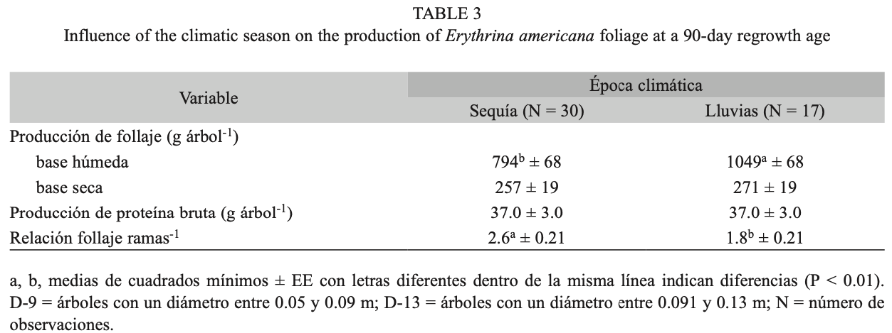

```{css, echo = F}
.badCode {
background-color: LIGHTGOLDENRODYELLOW;
}
/* dos columnas */
.column-left{
  display: inline-block;
  width: 48%;
  text-align: left;
  vertical-align: middle;
}
.column-right{
  display: inline-block;
  width: 48%;
  text-align: left;
  vertical-align: middle;
}

pre code, pre, code {
  white-space: pre !important;
  overflow-x: scroll !important;
  word-break: keep-all !important;
  word-wrap: initial !important;
}
```

```{r setup, include=FALSE}
library(knitr)
library(tidyverse)
library(checkdown)
library(details)
library(wakefield)
library(kableExtra)
library(flextable)
library(officer)
#library(learnr)
opts_chunk$set(echo = TRUE, comment = NULL, warning = F, 
               message = F, fig.align = 'center', class.output="badCode",
               fig.width = 3.4, fig.height = 3)
```

```{r colFmt, include = F}
# Funcion para colorear texto a discrecion en Rmarkdown
# tomada de: https://stackoverflow.com/questions/29067541/how-to-change-the-font-color
colFmt = function(x,color){
  outputFormat = knitr::opts_knit$get("rmarkdown.pandoc.to")
  if(outputFormat == 'latex')
    paste("\\textcolor{",color,"}{",x,"}",sep="")
  else if(outputFormat == 'html')
    paste("<font color='",color,"'>",x,"</font>",sep="")
  else
    x
}
colpkg <- function(x) colFmt(x = x, color = "goldenrod")
```


```{r klippy, echo=FALSE, include=TRUE}
klippy::klippy(position = "right")
```

```{r, echo = F, eval = F}
rintimg::img_intensify(target = ".png")  # para hacer zoom en imagenes
# Nota: el problema con esto es que tambien incluye la imagen del icono
# que pone el paquete klippy en la esquina superior de los chunk's de codigo
# entonces cuando se hace clic en este icono para copiar el codigo
# se agranda la imagen del codigo y esto es muy molesto.
```


***
En esta sesión revisamos los paquetes `flextable` y `kableExtra` para dar formato a tablas para presentación final en informes o artículos.

***

## Librerías

```{r}
library(tidyverse)
library(flextable)    # para diseñar tablas
library(knitr)        # para comando kable
library(kableExtra)   # complementos para kable
library(officer)      # complementos para flextable
library(magick)       # para trabajar con imagenes
```

<br>

También se requiere el paquete `r colpkg("webshot")` para salvar como imagen las tablas. Si es necesario, instale este paquete, y además, ejecute la siguiente línea de código:

```{r, eval = F}
# install.packages("webshot")   # para instalar el paquete (solo si se requiere)
webshot::install_phantomjs()    # para instalar el software phantomjs
```

<br>

Finalmente active el paquete:


```{r}
library(webshot)                # para salvar las tablas como imagen
```


<br>

## Manuales de los paquetes

- Consulte el manual/libro del paquete `r colpkg("flextable")` [aquí](https://ardata-fr.github.io/flextable-book/){target="Blank1"}.

- Consulte el manual del paquete `r colpkg("kableExtra")` [aquí](https://haozhu233.github.io/kableExtra/){target="Blank2"}.

- [Taller interactivo](http://gauss.inf.um.es:8080/tabular-tablas/#section-objetivos){target="Blank7"} para prácticar `r colpkg("kableExtra")`.

<br>

## Datos

Intentaremos dar formato para presentación a la tabla publicada por @oliva2021 la cual se muestra en la siguiente Figura:

<br>

```{r, echo = F, out.width='110%'}

```

<br>


Enseguida escribimos código **R** para entrar esta tabla en un `tibble`:

```{r}
tab <- tibble(
  Variable  = c("Prod. de follaje (g/árbol)", "Base húmeda",  "Base seca", 
                "Prod. de proteína bruta (g/árbol)", "Relación follaje/rama"),
  sequia_m = c(NA,794, 257, 37, 2.6),
  sequia_ee = c(NA,68,19,3,0.21),
  lluvia_m = c(NA,1049,271,37,1.8),
  lluvia_ee   = c(NA,68,19,3,0.21)
)
tab  # se imprime
```

<br>

## Paquete flextable

### Tabla por defecto

```{r}
flextable(tab)
```

<br>

### Modificando la tabla

#### _**autofit**_

```{r}
flextable(tab) %>%
  autofit()
```

<br>


#### _**Agrupando filas**_

Generamos una sangría para las filas 2 y 3 de tal manera que se genere una apariencia de subordinación, jerarquía o agrupamiento a la variable de la fila 1:

```{r}
flextable(tab) %>%
  padding(i = 2:3, j = 1, padding.left = 20) %>%
  autofit()
```

<br>

El aspecto de **agrupamiento de filas** se puede incorporar de forma explicita usando el comando `as_grouped_data` el cual crea un nuevo data.frame con la disposición correcta de columnas y NA's para que `flextable` muestre filas con agrupamiento. Revisar un poco más de esta opción en esta [pregunta en stackoverflow](https://stackoverflow.com/questions/55360767/flextable-how-to-show-group-headings-as-the-value-only-rather-as-the-variable-n){target="Blank3"}.


<br>

#### _**Juntando columnas con `r colpkg("dplyr")`**_

Usamos `mutate` (`r colpkg('dplyr')`) para concatenar las columnas de media y error estándar para cada época:

```{r}
# Creamos tabla con columnas concatenadas:
tab1 <- tab %>%
  mutate(
    `Sequia (N = 30)` = paste0(sequia_m, " (", sequia_ee, ")" ),
    `Lluvia (N = 30)` = paste0(lluvia_m, " (", lluvia_ee, ")" )
  ) %>% select(-(2:5))
tab1

# Se actualiza la fila 1 con NA
tab1[1,2:3] <- NA
tab1
```


<br>

Ahora aplicamos `flextable` sobre la nueva tabla:


```{r}
flextable(tab1) %>%
  padding(i = 2:3, j = 1, padding.left = 20) %>%
  align( j = 2:3, align = "center", part = "all" ) %>%
  autofit()
```

<br>

#### _**Agrupando columnas**_

El comando `add_header_rows` agrega filas a la parte del encabezado de la tabla con la opción de poner un texto que permita agrupar columnas de la tabla bajo la misma etiqueta o título. El siguiente código agrupa las columnas 2 y 3 bajo un mismo título (Época):

```{r}
flextable(tab1) %>%
  padding(i = 2:3, j = 1, padding.left = 20) %>%
  add_header_row(values = c(" ", "Época"), colwidths = c(1,2)) %>%
  align( j = 2:3, align = "center", part = "all" ) %>%
  bold(i = 1, part = "header") %>%
  autofit()
```

<br>

#### _**Personalizando bordes**_


```{r}
flextable(tab1) %>%
  padding(i = 2:3, j = 1, padding.left = 20) %>%
  add_header_row(values = c(" ", "Época"), colwidths = c(1,2)) %>%
  align( j = 2:3, align = "center", part = "all" ) %>%
  bold(part = "header") %>%
  autofit() %>%
  border_remove() %>%
  border(part = "header", i = 2, 
         border.bottom = fp_border(width = 0.5, color = "grey40")) %>%
  border(part = "header", i = 2, j = 2:3, 
         border.top = fp_border(width = 0.5, color = "grey40")) %>%
  border(part = "header", i = 1, border.top = fp_border(color = "orange")) %>%
  border(part = "body", i = 5, border.bottom = fp_border(color = "orange"))
```

<br>

#### _**Pies de tabla**_


```{r}
ft <- flextable(tab1) %>%
  padding(i = 2:3, j = 1, padding.left = 20) %>%
  add_header_row(values = c(" ", "Época"), colwidths = c(1,2)) %>%
  align( j = 2:3, align = "center", part = "all" ) %>%
  bold(part = "header") %>%
  autofit() %>%
  border_remove() %>%
  border(part = "header", i = 2, 
         border.bottom = fp_border(width = 0.5, color = "grey40")) %>%
  border(part = "header", i = 2, j = 2:3, 
         border.top = fp_border(width = 0.5, color = "grey40")) %>%
  border(part = "header", i = 1, border.top = fp_border(color = "orange")) %>%
  border(part = "body", i = 5, border.bottom = fp_border(color = "orange")) %>%
  flextable::footnote(
    i = 1, j = 2, value = as_paragraph("Media (error estándar)"),
    part = "header")

ft   # se imprime
```

<br>

### Exportando una flextable

La tabla creada por `flextable` se puede exportar como una imagen usando el comando `save_as_image`. El uso de este comando depende del paquete `r colpkg("webshot")`. El siguiente código muestra la manera de utilizar este comando:

```{r, eval = F}
save_as_image(ft, path = "mitabla.png")
```

Descargue el `png` producido [aquí](mitabla.png){target="Blank8"}.

La imagen queda en el directorio de trabajo  actual. La tabla también se puede guardar como una imagen desde el botón de "guardar" en el **Viewer** de Rstudio.

También, las tablas creadas por `flextable` dentro de chunks de código **R** en documentos **rmarkdown** permiten imprimirse a **html**, **word** o **latex/pdf**.

<br>

## Paquete kableExtra

El comando `kable` del paquete `r colpkg("knitr")` en conjunto con el paquete `r colpkg("kableExtra")` constituyen otra marco excelente para diseñar y formatear tablas para informes o artículos.

<br>

### Tabla por defecto

```{r}
kable(tab)
```

<br>

Para **esconder los NA's** utilice el siguiente código:


```{r}
options(knitr.kable.NA = '')
kable(tab)
```

<br>

### Modificando la tabla

#### _**Ancho total**_

```{r}
kable(tab) %>%
  kable_styling(full_width = F)
```

<br>

#### _**Agrupando filas**_

```{r}
kable(tab[-1, ]) %>%
  kable_styling(full_width = F) %>%
  pack_rows(group_label = "Prod. de follaje (g/árbol)", 
            start_row = 1, end_row = 2)
```

<br>

Un efecto de sangría (indentación) también crea subordinación y la apariencia de agrupación  de algunas filas:

```{r}
kable(tab) %>%
  kable_styling(full_width = F) %>%
  add_indent(c(2,3))
```

<br>

#### _**Agrupando columnas**_

El comando `add_header_above` agrega una fila de etiquetas para agrupar columnas. Su argumento principal, `header`, es un vector nombrado de números enteros. La suma de los números debe ser igual a la cantidad de columnas de la tabla. En el siguiente código usamos la tabla `tab1` creada arriba:

```{r}
kable(tab1, align = c("l", "c", "c")) %>%
  kable_styling(full_width = F) %>%
  add_header_above(header = c(" " = 1, Época = 2)) %>%
  add_indent(c(2,3))
```

<br>

#### _**Temas**_

```{r}
kable(tab1, align = c("l", "c", "c")) %>%
  kable_classic(full_width = F) %>%
  add_header_above(header = c(" " = 1, Época = 2)) %>%
  add_indent(c(2,3))
```


```{r}
kable(tab1, align = c("l", "c", "c")) %>%
  kable_classic_2(full_width = F) %>%
  add_header_above(header = c(" " = 1, Época = 2)) %>%
  add_indent(c(2,3))
```

```{r}
kable(tab1, align = c("l", "c", "c")) %>%
  kable_paper(full_width = F) %>%
  add_header_above(header = c(" " = 1, Época = 2)) %>%
  add_indent(c(2,3))
```

<br>

#### _**Pies de tabla**_

Los comandos `add_footnote` y `footnote` (más nuevo) del paquete `r colpkg("kableExtra")` adicionan pies de tabla. La dificultad es que el comando no pone el símbolo  en el interior de la tabla, sólo lo pone en el pie de tabla. El usuario debe encargarse de modificar la tabla para que el símbolo aparezca en el lugar correcto. Dado que usualmente estos símbolos se ponen como superíndices, o se utilizan símbolos no convencionales como *; &dagger;; &Dagger;; etc; se debe tener en cuenta el tipo salida de la tabla (html o latex/pdf) y la forma diferencial de escribir estos símbolos para html o latex.

El siguiente código adiciona un pie de tabla asociado a la época con un superíndice de 1 para compilar a html:


```{r}
kable(tab1, align = c("l", "c", "c")) %>%
  kable_styling(full_width = F) %>%
  add_header_above(header = c(" " = 1, "Época<sup>1</sup>" = 2), escape = F) %>%
  add_indent(c(2,3)) %>%
  kableExtra::footnote(number = "Media (error estándar)")
```

Los comandos `footnote_maker_symbol`, `footnote_maker_alphabet` y `footnote_maker_number` producen los símbolos correspondientes (y pueden ser usados en conjunto con el comando `paste0` para agregar los símbolos a la tabla). Por ejemplo:

```{r}
footnote_marker_symbol(1)
footnote_marker_symbol(2)
footnote_marker_alphabet(1)
footnote_marker_alphabet(2)
```

<br>

### Exportando la tabla

El comando `save_kable` guarda la tabla como una imagen o como pdf. Se recomienda guardarla como pdf para mejorar la resolución.

Se guarda desde un `html` y con un estilo `classic`:

```{r, eval = F}
kable(tab1, align = c("l", "c", "c"), format = "html") %>%
  kable_classic(full_width = F) %>%
  add_header_above(header = c(" " = 1, "Época<sup>1</sup>" = 2), escape = F) %>%
  add_indent(c(2,3)) %>%
  kableExtra::footnote(number = "Media (error estándar)") %>%
  save_kable(file = "mitabla_classic.pdf")
```

Descargue el `pdf` producido [aquí](mitabla_classic.pdf){target="Blank4"}.

<br>

Se guarda desde un `html` y con un estilo `classic`:

```{r, eval = F}
kable(tab1, align = c("l", "c", "c"), format = "html") %>%
  kable_classic_2(full_width = F) %>%
  add_header_above(header = c(" " = 1, "Época<sup>1</sup>" = 2), escape = F) %>%
  add_indent(c(2,3)) %>%
  kableExtra::footnote(number = "Media (error estándar)") %>%
  save_kable(file = "mitabla_classic2.pdf")
```

Descargue el `pdf` producido [aquí](mitabla_classic2.pdf){target="Blank5"}.

<br>

Se guarda desde `latex` y con la opción `booktabs = T`:

```{r, eval = F}
kable(tab1, align = c("l", "c", "c"), format = "latex", booktabs = T) %>%
  kable_styling(full_width = F) %>%
  add_header_above(header = c(" " = 1, "Época$^1$" = 2), escape = F) %>%
  add_indent(c(2,3)) %>%
  kableExtra::footnote(number = "Media (error estándar)") %>%
  save_kable(file = "mitabla_latex.pdf")
```

Descargue el `pdf` producido [aquí](mitabla_latex.pdf){target="Blank6"}


<br>

## Referencias


