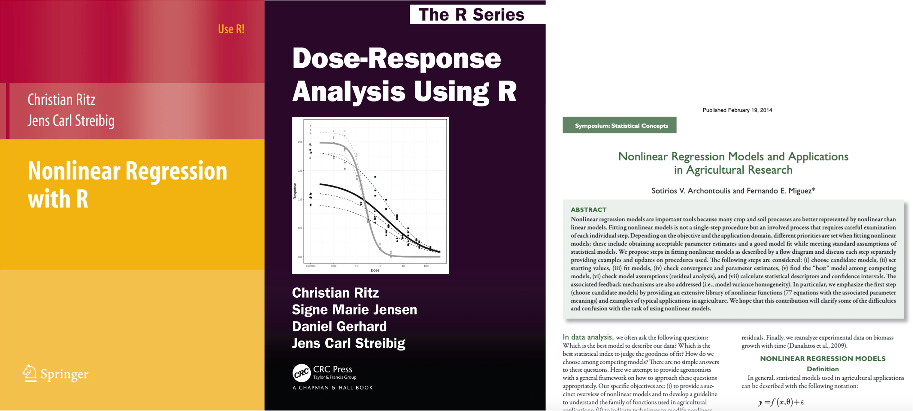

```{css, echo = F}
.badCode {
background-color: LIGHTGOLDENRODYELLOW;
}
/* dos columnas */
.column-left{
  display: inline-block;
  width: 48%;
  text-align: left;
  vertical-align: middle;
}
.column-right{
  display: inline-block;
  width: 48%;
  text-align: left;
  vertical-align: middle;
}

pre code, pre, code {
  white-space: pre !important;
  overflow-x: scroll !important;
  word-break: keep-all !important;
  word-wrap: initial !important;
}

div.csl-entry {
  line-height: 25px;   /* within paragraph */
  margin-bottom: 17px; /* between paragraphs */
}
```

```{r setup, include=FALSE}
library(knitr)
library(tidyverse)
library(checkdown)
library(details)
library(wakefield)
library(randomNames)
library(kableExtra)
#library(learnr)
opts_chunk$set(echo = TRUE, comment = NULL, warning = F, 
               message = F, fig.align = 'center', class.output="badCode",
               fig.width = 3.4, fig.height = 3)
```

```{r colFmt, include = F}
# Funcion para colorear texto a discrecion en Rmarkdown
# tomada de: https://stackoverflow.com/questions/29067541/how-to-change-the-font-color
colFmt = function(x,color){
  outputFormat = knitr::opts_knit$get("rmarkdown.pandoc.to")
  if(outputFormat == 'latex')
    paste("\\textcolor{",color,"}{",x,"}",sep="")
  else if(outputFormat == 'html')
    paste("<font color='",color,"'>",x,"</font>",sep="")
  else
    x
}
colpkg <- function(x) colFmt(x = x, color = "goldenrod")
```

```{r klippy, echo=FALSE, include=TRUE}
# install.packages("remotes")
# remotes::install_github("rlesur/klippy")
klippy::klippy(position = "right")
```

```{r, echo = F, eval = F}
rintimg::img_intensify(target = ".png")  # para hacer zoom en imagenes
# Nota: el problema con esto es que tambien incluye la imagen del icono
# que pone el paquete klippy en la esquina superior de los chunk's de codigo
# entonces cuando se hace clic en este icono para copiar el codigo
# se agranda la imagen del codigo y esto es molesto.
```

<br>

***

Existen ciertos fenómenos que se encuentran mejor modelados mediante funciones no lineales que con funciones lineales. En este recurso, presentamos una introducción sobre la aplicación de _regresión no lineal_ en **R**, una técnica para ajustar modelos **no lineales** a un conjunto de datos obtenidos en contextos experimentales u observacionales.

***

<br>

## Librerías

Usaremos las siguientes librerías

```{r, eval = F, include = F}
# Librerias que tienen que ver con regresion no lineal
library(NISTnls)
library(nlsMicrobio)
library(nlraa)
library(nlstools)
library(nls2)
library(drc)
```


```{r}
library(tidyverse)
```

<br>

## Literatura recomendada

```{r, echo = F, fig.width=8, fig.height=3, out.width="70%"}

```

- Ritz, C., & Streibig, J. C. (2008). [Nonlinear regression with R](https://link.springer.com/book/10.1007/978-0-387-09616-2){target="Blank1"}. Springer Science & Business Media

- Ritz, C., Jensen, S. M., Gerhard, D., & Streibig, J. C. (2020). [Dose-Response Analysis using R](https://www.routledge.com/Dose-Response-Analysis-Using-R/Ritz-Jensen-Gerhard-Streibig/p/book/9781032091815){target="Blank2"}. CRC Press.

- Archontoulis, S. V., & Miguez, F. E. (2015). Nonlinear regression models and applications in agricultural research. _Agronomy Journal_, [107(2), 786–798](https://doi.org/10.2134/agronj2012.0506){target="Blank3"}


```{r, eval = F, include = F}
library(nlraa)
library(tidyverse)
# Ejemplo 1 ----
# Tasa de extension de las hojas como respuesta a la temperatura
# del meristema en el maiz
maizeleafext %>%
  ggplot(aes(x = temp, y = rate)) + geom_point()


# Ejemplo 2 ----
# Datos originales en:
load("datos/L.minor.rda")
write.csv(x = L.minor, file = "datos/L_minor.csv", quote = F, row.names = F)

# Simulacion
Vm <- 126
K <- 17
dat <- tibble(
  conc    = c(2.5, 5, 7.5, 22, 28, 40, 45, 200),
  rate.mu = Vm*conc / (K + conc),
  rate    = rate.mu + rnorm(n = length(conc), mean = 0, sd = 0.1*rate.mu)
)
ggplot(dat, aes(x = conc, y = rate)) + geom_point() +
  geom_hline(yintercept = Vm, size = 0.4, linetype = "dashed") +
  geom_function(fun = ~ Vm*(.x) / (K + .x))


# Ajuste:
m <- nls(rate ~ Vm*conc / (K + conc), data = dat, 
         start = c(K = 20, Vm = 120), trace = T)
m
sqrt(deviance(m) / (8 - 2))
summary(m)

# Grafico con prediccion
pred <- tibble(
  conc = seq(from = min(dat$conc), to = max(dat$conc), length.out = 50),
  rate.pred = predict(m, newdata = data.frame(conc))
)


ggplot(dat, aes(x = conc, y = rate)) + geom_point() +
  geom_hline(yintercept = Vm, size = 0.4, linetype = "dashed") +
  geom_function(fun = ~ Vm*(.x) / (K + .x), color = "blue") +
  geom_line(aes(x = conc, y = rate.pred), data = pred, color = "red")

f.mm <- function(x, Vm, K) Vm*x / (K + x)
ggplot(dat, aes(x = conc, y = rate)) + geom_point() +
  geom_hline(yintercept = 126, size = 0.4, linetype = "dashed") +
  geom_function(aes(color = "ajustada"), fun = f.mm, 
                args = list(K = coef(m)["K"], Vm = coef(m)["Vm"])) +
  geom_function(aes(color = "original"), fun = f.mm, 
                args = list(K = 17, Vm = 126))

# Ejemplo 3 ----
load("datos/RGRcurve.rda")
write.csv(x = RGRcurve, file = "datos/RGRcurve.csv", quote = F, row.names = F)

# Grafico
ggplot(RGRcurve, aes(Day, RGR)) + geom_point()

# Funcion
f.exp <- function(Day, b, y0) y0*exp(Day / b)

ggplot(RGRcurve, aes(Day, RGR)) + geom_point() +
  geom_function(fun = f.exp, args = list(b = 3.76, y0 = 0.164), color = "blue")


m <- nls( RGR ~ f.exp(Day, b, y0), data = RGRcurve, 
         start = c(b = 4.4, y0 = 0.2), trace = T)
summary(m)


# Ejemplo 4 ----
library(MASS)
head(wtloss)
f.biexp <- function(Days, b1, b2, b3) b1*2^(-Days/b2) + b3
ggplot(wtloss, aes(x = Days, y = Weight)) + geom_point(alpha = 0.4, size = 3) +
  geom_function(fun = f.biexp, color = "blue",
                args = list(b1 = 102.684, b2 = 141.91, b3 = 81.374))


m <- nls(Weight ~ f.biexp(Days, b1, b2, b3), data = wtloss, 
         start = c(b1 = 110, b2 = 100, b3 = 80), trace = T)
summary(m)
head(NISTnls::Chwirut1)
plot(NISTnls::Chwirut1[, c(2,1)], log = "x")
?NISTnls::Chwirut1
library(NISTnls)
Try <- function(expr) if (!inherits(val <- try(expr), "try-error")) val
Try(fm1 <- nls(y ~ exp(-b1*x)/(b2+b3*x), data = Chwirut1, trace = TRUE,
           start = c(b1 = 0.1, b2 = 0.01, b3 = 0.02)))
```

```{r datos, include = F, eval = F}
library(drc)
lettuce
write.csv(lettuce, file = "datos/lettuce.csv", quote = F, row.names = F)
load("datos/RGRcurve.rda")
write.csv(x = RGRcurve, file = "datos/RGRcurve.csv", quote = F, row.names = F)
```


## Introducción

Cuando la variable respuesta tiene una relación no lineal con ciertas predictoras, ajustar un **modelo no lineal** puede ser una alternativa más parsimoniosa que otras opciones [@archontoulis2015] como _regresión lineal con términos polinómicos_ o ajustar curvas _loess_. La Figura 1 presenta algunos ejemplos de datos reales que exhiben patrones no lineales.

<br>

```{r curvas, echo = F, results = "hide", fig.width=10, fig.height=3, fig.cap = "Ejemplos de datos con patrones no lineales. En los tres casos, los puntos representan los datos observados y las líneas indican el compartamiento medio estimado por una función o modelo no lineal. (A) Experimento de dosis-respuesta en el cual la biomasa de plantas de [lechuga](datos/lettuce.csv) cambia con un aumento en la concentración de alcohol isobutílico. (B) [Tasa de crecimiento relativo](datos/RGRcurve.csv) en el tiempo para una especie vegetal. (C) Tasas de reacción enzimática en función de la cantidad de sustrato en cultivos celulares tratados y no tratados con Puromicina (En **R**, estos datos se activan como: `data(Puromycin)`)."}

# Algunos parametros graficos
col <- scales::hue_pal()(1)  # color lineas y puntos
sp <- 2                      # tamano puntos
sl <- 0.9                    # tamano lineas
a <- 0.8                     # transparencia puntos

# Datos de lettuce ----
# Biomasa de plantas de lechuga en funcion de la conc. de alcohol isobutilico
# Grafico base:
lettuce <- read.csv("datos/lettuce.csv")
str(lettuce)
summary(lettuce)

# Grafico base:
gg <- ggplot(lettuce, aes(x = conc, y = weight)) + 
  geom_point(alpha = a, size = sp, colour = col) +
  scale_x_continuous(trans = "log1p", limits = c(0,100), 
                     expand = c(0,0.2), breaks = c(0,1,5,10,25,50,75,100)) + 
  labs(x = "Concentración (mg/l)", y = "Biomasa (g)", title = "lettuce.csv") +
  theme_bw()

# Ajuste del modelo
m <- nls(weight ~ (d + f*conc)/(1 + exp(b*(log(conc) - log(e)))), data = lettuce,
         start = c(b = 1, f = 0.6, d = 1, e = 1))
m.nd <- data.frame(conc = seq(0,100,0.1), weight = predict(m, list(conc = seq(0,100,0.1))))

# Grafico final
gg.lett <- gg + geom_line(data = m.nd, color = col, size = sl)

# Otro ajuste posible (no tan bueno)
# m <- nls(weight ~ c + (d-c)/(1 + exp(b*(log(conc) - log(e)))), data = lettuce,
#          start = c(b = 1, c = 0.6, d = 8, e = 3))

# Datos RGRcurve ----
# Tasa de crecimiento relativo registrado a traves de varios dias en una especie vegetal
RGRcurve <- read.csv("datos/RGRcurve.csv")
str(RGRcurve)
summary(RGRcurve)

gg <- ggplot(RGRcurve, aes(Day, RGR)) + 
  geom_point(alpha = a, size = sp, colour = col) +
  labs(y = "Crecimiento relativo (%)", x = "Tiempo (días)", 
       title = "RGRcurve.csv") +
  theme_bw()

# Modelo:
m <- nls( RGR ~ y0*exp(Day/b), data = RGRcurve, 
         start = c(b = 4.4, y0 = 0.2))
m.nd <- data.frame(Day = seq(0,8,0.1), RGR = predict(m, list(Day = seq(0,8,0.1))))
gg.RGRcurve <- gg + geom_line(data = m.nd, color = col, size = sl)

# Datos puromicina ----
str(Puromycin)
summary(Puromycin)

# Grafico base
gg <- ggplot(Puromycin, aes(x = conc, y = rate, color = state)) + 
  geom_point(alpha = a, size = sp) +
  labs(x = "Concentración del sustrato (ppm)", 
       y = "Tasa de reacción\n(conteos/min/min)",
       title = "Puromycin") +
  theme_bw() + theme(legend.position = c(0.7, 0.3), 
                     legend.background = element_rect(colour = "black", size = 0.1))

# Modelo:
m <- nls(rate ~ Vm[state] * conc / (K[state] + conc), data = Puromycin, 
         start = list(K = c(0.1, 0.1), Vm = c(200, 200)))
m.nd <- expand_grid(conc = seq(0,1.2,0.02), 
                    state = c("treated", "untreated"))
m.nd$state <- factor(m.nd$state)
m.nd <- mutate(
    m.nd,
    rate = predict(m, newdata = m.nd)
  )
gg.puromycin <- gg + geom_line(data = m.nd, size = sl)

# Grafico con los tres:
library(cowplot)
plot_grid(gg.lett, gg.RGRcurve, gg.puromycin, 
          labels = c("A", "B", "C"), nrow = 1)                   
```

<br>

En la Figura \@ref(fig:curvas), las curvas en cada ejemplo representan el compartamiento _medio_ estimado por un modelo o función no lineal. Por ejemplo, de acuerdo a @ritz2008, para los datos [lettuce.csv](datos/lettuce.csv) de la Figura \@ref(fig:curvas)A, se ajustó el modelo no lineal de _Brain Cousens_ dado por la ecuación:

\begin{equation}
f(x) = \dfrac{\lambda + \theta\cdot x}{1+\left(\frac{x}{\tau}\right)^{\beta}}
(\#eq:brainCousens)
\end{equation}

El modelo \@ref(eq:brainCousens) tiene cuatro parámetros ($\lambda$, $\theta$, $\tau$ y $\beta$) y particularmente puede ser útil para describir relaciones de _dosis - respuesta_ donde se espera que la respuesta exhiba un deacamiento cuando hay exposición a una sustancia potencialmente tóxica, pero cuando la caída se evidencia en altos valores de la sustancia [@ritz2008]. En otro ejemplo, el modelo ajustado para los datos de Puromicina de la Figura \@ref(fig:curvas)C es el de Michaelis-Menten, dado por:


\begin{equation}
f(x) = \dfrac{(V_m + \beta \cdot z) \cdot x}{K + x}
(\#eq:mm)
\end{equation}

En el modelo \@ref(eq:mm), $x$ es la concentración del sustrato (una variable predictora), $z$ es 1 si el cultivo es tratado con Puromicina o 0 si no lo es (una segunda variable predictora), mientras que $V_m$, $\beta$ y $K$ son parámetros del modelo.

En este recurso revisaremos, de forma introductoria, como ejecutar la técnica de **regresión no lineal** en **R**, para estimar los parámetros de modelos no lineales como la función \@ref(eq:brainCousens) o la función  \@ref(eq:mm) desde datos o muestras obtenidas en escenarios como los ejemplos de la Figura \@ref(fig:curvas). La teoría y ejemplos mostrados son basados principalmente en el libro de @ritz2008.

<br>

## Conceptos sobre regresión no lineal

### El modelo

Para un conjunto de pares de datos (x~i~, y~i~) con $i = \{1,2,\ldots,n\}$ y donde $x$ es la variable predictora y $y$ es la variable respuesta, la técnica de **regresión no lineal** considera la siguiente relación entre la respuesta $y$ y la predictora $x$:

\begin{equation}
y_i = f(x_i,\beta) + \varepsilon_i  
(\#eq:yi)
\end{equation}

De acuerdo a @ritz2008, una descripción del modelo \@ref(eq:yi) es la siguiente:

- $f(x_i,\beta)$ es alguna función matemática que representa el comportamiento _medio_ de $y$ cuando la predictora $x$ incrementa. Se aclara que la función $f$ puede tener más de una predictora como el ejemplo de la Figura 1C.

- La función $f$ también depende de $\beta$ que representa los parámetros del modelo. Estos deben ser _estimados_ desde el conjunto de datos. Si existen $n$ datos y el modelo tiene $p$ parámetros, debe cumplirse que $n > p$ para poder realizar la estimación.

- Otro aspecto de la función $f$ es que debe ser _no lineal_ en al menos uno de los parámetros. El concepto de _no lineal_ en los parámetros quiere decir, que la función $f$ **no se puede** escribir como una _combinación lineal_ de las variables predictoras y los parámetros. Si la función $f$ fuera lineal en sus parámetros, podríamos/deberíamos usar la regresión lineal clásica.

- $\varepsilon_i$ representa el error o diferencia que existe entre cada $y_i$ y la media de $y_i$. Dicho error es aleatorio y ocurre debido a diferentes fuentes de variación no contraladas en el proceso de medición. La técnica de **regresión no lineal** asume que los errores siguen una distribución normal con media 0 y cierta varianza $\sigma^2$.

### Mínimos cuadrados

La técnica de regresión no lineal estima los parámetros del modelo usando el **criterio de mínimos cuadrados**, en el cual se encuentran los valores para los parámetros ($\beta$ en el modelo \@ref(eq:yi)) de tal forma que se minimice la siguiente suma:

\begin{equation}
RSS(\beta) = \sum_{i = 1}^n (\ y_i - f(x_i,\beta)\ )^2  
(\#eq:rss)
\end{equation}

La minimización de _RSS_ es un problema _no lineal_ debido a la _no linealidad_ de la función $f$ y por ende se requieren **métodos de optimización numérica** para su ejecución [@ritz2008]. Existen varios métodos para optimización numérica, siendo quizas el de **Gauss-Newton** el más común [@ritz2008].

### Valores iniciales

Un aspecto relevante para que los métodos de optimización se ejecuten con éxito es que se deben proveer **valores iniciales** para los parámetros ($\beta$) del modelo. Para esto tenemos dos opciones:

- Calcular (a mano) un estimado grueso de los parámetros que sirva como valores iniciales e indicarle directamente dichos valores al programa que realiza la estimación.

- Usar funciones de **auto inicio** (**S**elf **S**tart) que internamente calculan dichos valores iniciales y se los entregan al programa que realiza la estimación. Para cada modelo $f$ que se quiera ajustar se requiere una función de auto inicio específica.

```{r Mmerluc, include = F, eval = F}
load("datos/M.merluccius.rda")
str(M.merluccius)
summary(M.merluccius)

# Grafico
ggplot(M.merluccius, aes(x = spawn.biomass, y = num.fish)) + geom_point()

# Ajuste del modelo:
f <- function(x, alfa, k)  alfa*x / (1 + x/k)   # modelo de Beverton-Holt
# alfa*k = asintota
# k = valor de x al cual se alcanza la mitad de 'y'
m <- nls(num.fish ~ f(spawn.biomass, alfa, k), data = M.merluccius, start = c(alfa = 4, k = 30))
summary(m)

# Grafico + modelo:
ggplot(M.merluccius, aes(x = spawn.biomass, y = num.fish)) + 
  geom_point() +
  geom_function(aes(color = "nls"), fun = f,
                args = list(alfa = coef(m)["alfa"], k = coef(m)["k"])) +
  geom_function(aes(color = "Cadima (2003, p. 131)"), fun = f,
                args = list(alfa = 4.91, k = 45.39)) +
  labs(colour = "Ajustes")
```


<br>

## Comando `nls` de **R**

El comando `nls` realiza regresión no lineal. Sus argumentos principales son:

- `formula`: Aquí se específica el modelo. Existen al menos tres maneras de especificarla.
- `data`: El data.frame que contiene los datos para la respuesta y las predictoras. Los nombres de las columnas en este data.frame deben ser usados en la fórmula.
- `start`: Vector (o lista) nombrado con los valores iniciales de los parámetros.

### Ejemplo 1: RGRcurve

Considere los [datos](datos/RGRcurve.csv) sobre el crecimiento relativo de cierta especie vegetal en el tiempo de la Figura \@ref(fig:curvas)B:

```{r, eval = F, echo = -3}
# Codigo R para importar los datos:
RGRcurve <- read.csv("RGRcurve.csv")
str(RGRcurve)
```

```{r, echo = F}
str(RGRcurve)
```

Use estos datos para ajustar el modelo exponencial de dos parámetros dado por: 

\begin{equation}
f(x) = y_0 e^{x/\theta}
(\#eq:mexp)
\end{equation}

donde $x$ es la predictora (`Day`), y $f$ es la respuesta (`RGR`). Los parámetros son $y_0$ y $\theta$. Observe que si $x = 0$, $f(0) = y_0$, de modo que $y_0$ es el valor de la `RGR` en el `Day` = 0. De otro lado, $\theta$ debe ser un tipo de pendiente. Observe que cuando $x = \theta$, la `RGR` ha duplicado (aproximadamente) el valor $y_0$. 

<br>

:::: {.orangebox data-latex=""}

**Ejercicio 1**

Escriba código **R** para realizar un diagrama de dispersión con los datos y, desde el gráfico, genere un estimado grueso (al ojo) del valor de $y_0$ y $\theta$ usando la descripción de estos parámetros dada anteriormente.

```{r, echo = F}
cod <- '# Lectura de datos
RGRcurve <- read.csv("RGRcurve.csv")

# Grafico
ggplot(RGRcurve, aes(x = Day, y = RGR)) + geom_point() +
  scale_y_continuous(breaks = seq(0,2,0.1))'

razon <- "El valor y0 debe estar alrededor de 0.2. Este valor se duplica (2*0.2 = 0.4) cuando\nDay esta entre 3 y 4. Luego el valor de theta debe estar cerca a 3.5."

details(cod, summary = "**Código solución del gráfico**")
details(razon, summary = "**Razonamiento sobre los valores para y~0~ y &theta;**")
```

::::

<br>

:::: {.orangebox data-latex=""}

**Ejercicio 2**

Escriba código **R** que realice una diagrama de dispersión de los datos y agregue la curva del modelo utilizando los valores para los parámetros encontrados en el ejercicio anterior.

```{r, echo = F}
cod <- '# Grafico base
gg <- ggplot(RGRcurve, aes(x = Day, y = RGR)) + geom_point() +
  scale_y_continuous(breaks = seq(0,2,0.1))

# Se agregan curvas para algunos valores de theta:
gg +
  geom_function(aes(color = "theta = 3.5"), 
                fun = function(x) 0.2*exp(x/3.5) ) +
  geom_function(aes(color = "theta = 4"), 
                fun = function(x) 0.2*exp(x/4) ) +
  geom_function(aes(color = "theta = 5"), 
                fun = function(x) 0.2*exp(x/5) )'

details(cod, summary = "**Código solución del gráfico**")
```

::::

<br>

El siguiente código **R** ejecuta el comando `nls` utilizando como valores iniciales para los parámetros, los estimados generados "al ojo" desde los ejercicios 1 y 2.

```{r}
# Codigo R para ejecutar regresion no lineal con el comando nls:
m <- nls(RGR ~ y0*exp(Day / theta), data = RGRcurve, 
         start = c(y0 = 0.2, theta = 3.5))
summary(m)
```


<br>

:::: {.orangebox data-latex=""}

**Ejercicio 3**

Escriba código **R** que realice una diagrama de dispersión de los datos y agregue la curva del modelo ajustado con el comando `nls` en el código anterior. 

```{r, echo = F}
cod <- '# Se extrae la estimacion de los parametros
mpar <- coef(m)
mpar  # se imprime para revisar

# Grafico base
gg <- ggplot(RGRcurve, aes(x = Day, y = RGR)) + geom_point() +
  scale_y_continuous(breaks = seq(0,2,0.1))

# Se agrega la curva del modelo ajustado:
gg + geom_function(fun = function(x) mpar[1]*exp(x/mpar[2]), 
                   color = "blue" )'

details(cod, summary = "**Código solución del gráfico**")
```

::::

### Ejemplo 2: Puromicina

Considere los datos sobre la velocidad de reacción en función del sustrato para cultivos celulares tratados o no con Puromicina de la  Figura \@ref(fig:curvas)C:

```{r, eval = T}
# Codigo R para activar los datos de Puromicina
puromy <- Puromycin
str(puromy)
```


Use estos datos para ajustar el modelo de Michaelis-Menten con cuatro parámetros dado por la función \@ref(eq:mm) ya presentada en la introducción: 

\begin{equation*}
f(x) = \dfrac{(V_m + \beta \cdot z) \cdot x}{K + x}
\end{equation*}

donde $x$ es la predictora que se refiere a la `conc` del sustrato, $z$ es la predictora que se refiere a `state`, es decir, si el cultivo fue tratado o no con puromicina y $f$ es la media de la respuesta (`rate`). Los parámetros son $V_m$, $K$ y $\beta$. La predictora $z$ se puede trabajar como una variable dummy (indicadora) tomando el valor de 1 si el cultivo es tratado y 0 si no lo es. Para crear esta variable indicadora en **R** use el siguiente código:

```{r}
# Codigo R para crear la variable indicadora z:
library(tidyverse)
puromy <- mutate(puromy, z = ifelse(state == "treated", 1, 0))
str(puromy)
```


<br>

:::: {.orangebox data-latex=""}

**Ejercicio 4**

Al ojo anticipe valores aproximados para los parámetros del modelo \@ref(eq:mm); use estos como valores iniciales en el comando `nls` para ajustar el modelo \@ref(eq:mm).

Realice un gráfico que presente los puntos observados y las curvas del modelo para cada grupo de células (tratadas y no tratadas).

¿Podría realizar una prueba de hipótesis que compare la asintota de los dos grupos de células? Es decir:

$$H_0: V^{(z = 0)}_m = V^{(z = 1)}_m  \quad \text{ contra } \quad H_1: V^{(z = 0)}_m \neq V^{(z = 1)}_m$$

Explique. 

```{r, echo = F}
cod <- '# Se ejecuta el modelo para datos de puromy
m <- nls(rate ~ (Vm + beta*z)*conc / (K + conc), data = puromy, 
         start = c(Vm = 150, K = 0.1, beta = 50))
summary(m)

# Se realiza una tabla valores de las predictoras
nd <- expand.grid(
  conc = seq(0,1.3,0.05),
  z    = c(0,1)
)

# Se calculan las predicciones
nd$rate  <- predict(m, newdata = nd)

# Se agrega una columna de state
nd$state <- ifelse(nd$z == 1, "treated", "untreated")
head(nd, 3)

# Grafico
ggplot(puromy, aes(x = conc, y = rate, color = state)) + 
  geom_point() +
  geom_line(data = nd)'

details(cod, summary = "**Código solución**")
```

::::


<br>

## Referencias {#ref}

<div id="refs"></div>

<br>

## Para saber más

### Parámetros lineales y no lineales

La función $f$ en \@ref(eq:yi) puede tener una mezcla de parámetros lineales y no lineales, y esta condición puede ser evaluada. Un parámetro es no lineal cuando la segunda derivada de la función $f$ con respecto al parámetro no es cero [@archontoulis2015].

<br>

#### Derivando en R

El comando `D()` del paquete `mosaicCalc` permite ejecutar derivadas con una sintaxis sencilla. Por ejemplo, suponga la siguiente función:

$f(x) = a + bx^2$

Recordando conceptos de cálculo diferencial, la derivada de esta función con respecto a $x$ es:

$f'(x) = \dfrac{df}{dx} = 2bx$

Esta derivada se puede obtener con el comando `D()` (paquete `mosaicCalc`) como:

```{r}
library(mosaicCalc)
dx <- D(a + b*x^2 ~ x)
dx
```

La 2da. derivada no es más que la derivada de la derivada. Así, la derivada de $f'(x)$ está dada por:

$f''(x) =  \dfrac{d}{dx}\left( \dfrac{df}{dx}\right) = 2b$

En **R** esto se logra aplicando una segunda vez el comando `D()` sobre el resultado previo de este mismo comando:

```{r}
# Aplicando derivada a la derivada de la funcion anterior
D(dx(x) ~ x)
```

Para ahorrar escritura de código, el comando `D()` permite la siguiente sintaxis para ejecutar la 2da. derivada:

```{r}
# Calculando directamente la 2da. derivada de la 
# funcion f original con respecto a x
D(a + b*x^2 ~ x & x)
```

<br>

#### Verificando linealidad sobre los parámetros

Podemos entonces usar el comando `D()` para verificar si un parámetro es lineal en cierta función $f$. Por ejemplo en el modelo de Michaelis-Menten:

$$f(x) = \dfrac{V_m x}{K + x}$$

el parámetro $V_m$ es lineal puesto que:

```{r}
# 2da. derivada con respecto a Vm
D(Vm*x / (K + x) ~ Vm & Vm)
```

mientras que el parámetro $K$ no es lineal puesto que:

```{r}
# 2da. derivada con respecto a K
D(Vm*x / (K + x) ~ K & K)
```


<br>

#### Aprovechando la condición de linealidad

Si al menos uno de los parámetros en un modelo es lineal de acuerdo a la regla de la 2da. derivada mostrada en la sección anterior, podemos aprovechar esta condición para facilitar el proceso de estimación por mínimos cuadrados. 

El comando `nls` tiene el argumento `algorithm` en el cual se define el método de optimización numérica. Por defecto, dicho método es el de Gauss-Newton. Sin embargo, aquí también podemos indicar el método de Golub-Pereyra (`plinear`) de _mínimos cuadrados parcialmente lineales_. Al seleccionar este método, sólo debemos definir valores de inicio para aquellos parámetros _no_ lineales, aunque al escribir la fórmula del modelo, también se debe omitir el parámetro. Revisar más sobre este aspecto en la sección 4.3 de @ritz2008.

<br>

### Datos agrupados

Con datos agrupados nos refererimos a escenarios en donde se intenta comparar la función media entre dos o más grupos como en el ejemplo de la Puromycina de la Figura \@ref(fig:curvas)C. Observe que la comparación de los grupos se manejo usando el parámetro $\beta$ y la variable dummy $z$, la cual era 1 si `state = treated` y 0 si `state = untreated`. Otra manera de realizar la comparación o ajustar simultaneamente el mismo modelo para cada grupo (y luego tener la posibilidad de compararlos) es con la siguiente sintaxis:

```{r}
# Codigo R para ejecutar un modelo separado para cada grupo:
# (Datos agrupados)
m <- nls(rate ~ Vm[state]*conc / (K[state] + conc), data = puromy,
         start = list(Vm = c(200, 160), K = c(0.01, 0.01)) )
summary(m)
```

Observese que para cada parámetro, se reportan estimaciones para las dos categorías de la variable `state`. Revisar el capítulo 8 de @ritz2008 para más aspectos sobre este tema.


<br>

