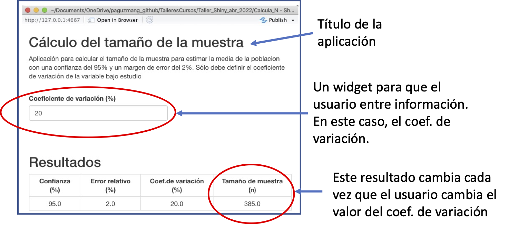
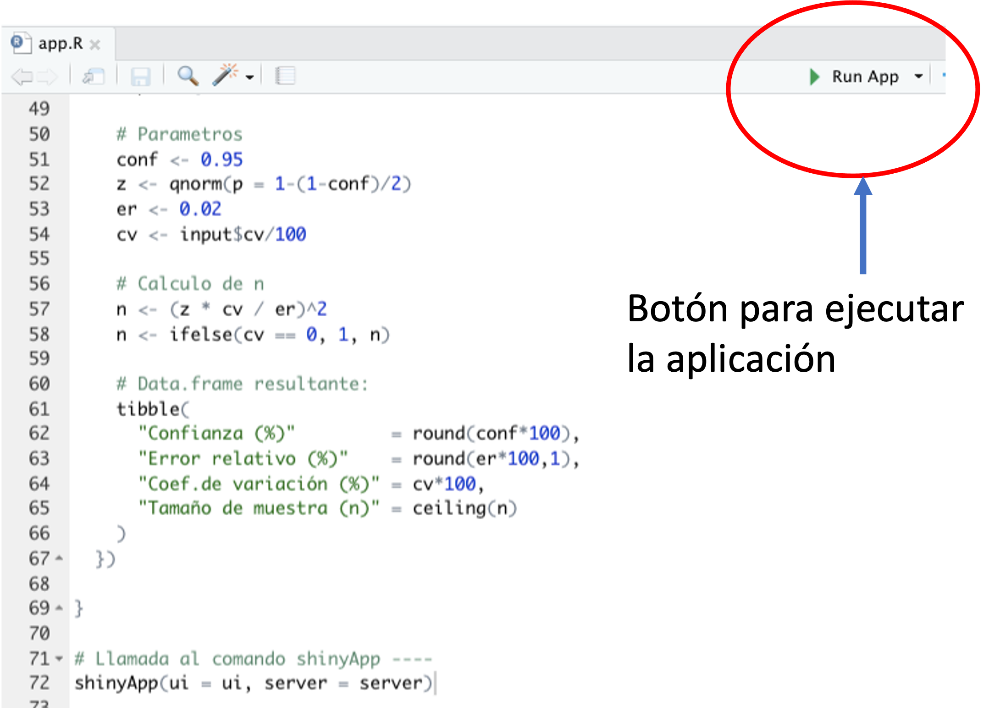

```{css, echo = F}
.badCode {
background-color: LIGHTGOLDENRODYELLOW;
}
/* dos columnas */
.column-left{
  display: inline-block;
  width: 48%;
  text-align: left;
  vertical-align: middle;
}
.column-right{
  display: inline-block;
  width: 48%;
  text-align: left;
  vertical-align: middle;
}

pre code, pre, code {
  white-space: pre !important;
  overflow-x: scroll !important;
  word-break: keep-all !important;
  word-wrap: initial !important;
}
```

```{r setup, include=FALSE}
library(knitr)
library(tidyverse)
library(checkdown)
library(details)
library(wakefield)
library(randomNames)
library(kableExtra)
#library(learnr)
opts_chunk$set(echo = TRUE, comment = NULL, warning = F, 
               message = F, fig.align = 'center', class.output="badCode",
               fig.width = 3.4, fig.height = 3)
```

```{r colFmt, include = F}
# Funcion para colorear texto a discrecion en Rmarkdown
# tomada de: https://stackoverflow.com/questions/29067541/how-to-change-the-font-color
colFmt = function(x,color){
  outputFormat = knitr::opts_knit$get("rmarkdown.pandoc.to")
  if(outputFormat == 'latex')
    paste("\\textcolor{",color,"}{",x,"}",sep="")
  else if(outputFormat == 'html')
    paste("<font color='",color,"'>",x,"</font>",sep="")
  else
    x
}
colpkg <- function(x) colFmt(x = x, color = "goldenrod")
```


```{r klippy, echo=FALSE, include=TRUE}
klippy::klippy(position = "right")
```

```{r, echo = F, eval = F}
rintimg::img_intensify(target = ".png")  # para hacer zoom en imagenes
# Nota: el problema con esto es que tambien incluye la imagen del icono
# que pone el paquete klippy en la esquina superior de los chunk's de codigo
# entonces cuando se hace clic en este icono para copiar el codigo
# se agranda la imagen del codigo y esto es molesto.
```

***
El paquete **shiny** permite construir aplicaciones web interactivas (apps) directamente desde **R**. En esta sesión revisaremos los componentes de la aplicación con un ejemplo sencillo sobre el cálculo del tamaño de la muestra. 

El material conceptual esta basado en las lecciones 1 a 4 del [tutorial](https://shiny.rstudio.com/tutorial/written-tutorial/lesson1/){target="Blank1"} de **shiny** de **Rstudio**. Se recomienda también descargar la hoja de referencia del paquete **shiny** [aquí](https://shiny.rstudio.com/images/shiny-cheatsheet.pdf){target="Blank2"}.

***

## Libros recomendados

```{r, echo = F, out.width="60%"}

```


## Ejemplo

La siguiente figura presenta un ejemplo de una apliación **shiny** que ayuda a calcular el tamaño de la muestra para estimar la media de la población:

```{r ejApp, echo = F, fig.width=7, fig.height=4, fig.cap = "Ejemplo de aplicación Shiny"}

```


```{r, echo = F, out.width="100%", eval = F}
knitr::include_app("https://paguzman.shinyapps.io/Modelos_de_Probabilidad/", 
                   height = "800px")
```

En este ejemplo, el tamaño de la muestra ($n$) cambia de acuerdo a tres cantidades relacionados de la siguiente forma:

$$n = \left(\dfrac{z_{1-\alpha/2} \times cv}{er}\right)^2$$
donde: 

* $z_{1-\alpha/2}$ es el cuantil $1-\alpha/2$ de la distribución normal estándar. Esta cantidad depende de la confianza que el usuario desee. La confianza es $1-\alpha$. La aplicación deja fija la confianza en 0.95, de modo que el cuantil utilizado es $z_{0.975}$.

* $cv$ es el coeficiente de variación de la variable bajo estudio. Este valor lo debe entrar el usuario. En la fórmula debe estar como una fracción aunque el usuario lo entra como porcentaje.

* $er$ es el margen de error relativo con respecto al tamaño de la media. Esto es la mitad de la amplitud del intervalo de confianza. La aplicación deja fija o constante este margen de error en 2%. Es decir, 0.02 en la fórmula.

Así la aplicación provee una casilla para que el usuario ingrese el $cv$ (en porcentaje) y la aplicación actualiza el tamaño de la muestra en consecuencia.

<br>

## Componentes de una aplicación Shiny

Una aplicación Shiny tiene tres componentes:

- Un objeto que define la disposición de información y espacios en la interface de usuario (`ui`).

- Una función `server` que contiene el código **R** que realiza el "trabajo pesado" (cálculos).

- Usar la función `shinyApp` para ejecutar la aplicación. Esta función junta el objeto `ui` y la función `server` para montar la aplicación.

Los tres componentes deben ir en un archivo script (.R) llamado `app.R`. Este archivo script tiene entonces la siguiente plantilla:

<br>

```{r, eval = F}
library(shiny)

# Objeto UI ----
ui <- ...

# Funcion server ----
server <- ...

# Llamado a shinyApp ----
shinyApp(ui = ui, server = server)
```

<br>

## Interface de usuario

El objeto `ui` define la interface de usuario y los objetos que se mostraran en cada espacio. Un comando frecuente con el cual se crea el objeto `ui` es `fluidPage`. Dentro del comando `fluidPage` deben ubicarse, principalmente, dos tipos de objetos:

- Objetos creado por los comandos del tipo `nnnnInput` (p.e.: `numericInput`, `sliderInput`, `selectInput`, etc.) que crean un `widget` para que el usuario entre o defina información para la aplicación. Revise este tipo de comandos [aquí](https://shiny.rstudio.com/tutorial/written-tutorial/lesson3/).

- Objetos creados por comandos del tipo `nnnnOutput` (p.e.: `tableOutput`, `plotOutput`, `imageOutput`,  etc.) que permiten establecer el tipo de resultado que se mostrará. Revise este tipo de comandos [aquí](https://shiny.rstudio.com/tutorial/written-tutorial/lesson4/).

Dentro del comando `fluidPage` se pueden poner otros objetos más estéticos tales como el título de la aplicación, texto libre para agregar explicaciones, etc. El contenido del objeto `ui` para la aplicación del cálculo del tamaño de la muestra es:


```{r, eval = F}
# Objeto UI -----
ui <- fluidPage(
  
      # Titulo
      titlePanel("Cálculo del tamaño de la muestra"),
      
      # Un parrafo
      p("Aplicación para calcular el tamaño de la muestra para estimar la media de la poblacion con una confianza del 95% y un margen de error del 2%. Sólo debe definir el coeficiente de variación de la variable bajo estudio"),
      
      br(),  # salto de linea
  
      # Input: Entrada numerica del CV 
      numericInput(inputId = "cv",
                  label = "Coeficiente de variación (%)",
                  min = 0,
                  max = 500, step = 5,
                  value = 20),
      
      br(),
      br(),
      
      # Titulo para la tabla de resultados
      h2("Resultados"),
      
      # Se definen el tipo de resultado con un id
      tableOutput(outputId = "tablaRes")
)
```

<br>

## Función server

La función `server` contiene el código **R** que recibe los datos ingresados por el usuario desde los "inputs" y los transforma para producir un objeto o gráfico resultante.

La función server debe incorporar los comandos del tipo `renderNnnn` (p.e., `renderPlot`, `renderTable`, `renderText`, etc.). Revise este tipo de comandos [aquí](https://shiny.rstudio.com/tutorial/written-tutorial/lesson4/). Los comandos tipo `renderNnnn` son correspondientes con los del tipo `nnnnOutput` ubicados en el objeto `ui`. P.e., el comando de salida `tableOutput` se corresponde con el comando `renderTable`.

La función server para la aplicación del cálculo del tamaño de la muestra es:

```{r, eval = F}
# Funcion server -----
server <- function(input, output){
  
  output$tablaRes <- renderTable(
    
    align = "c", digits = 1, bordered = T,
    
    expr = {
    
    # Parametros
    conf <- 0.95
    z <- qnorm(p = 1-(1-conf)/2)
    er <- 0.02
    cv <- input$cv/100
    
    # Calculo de n
    n <- (z * cv / er)^2
    n <- ifelse(cv == 0, 1, n)
    
    # Data.frame resultante:
    tibble(
      "Confianza (%)"         = round(conf*100), 
      "Error relativo (%)"    = round(er*100,1),
      "Coef.de variación (%)" = cv*100,
      "Tamaño de muestra (n)" = ceiling(n)
    )
  })
  
}
```

<br>


## shinyApp y ejecutando la aplicación

El tercer componente del código con la aplicación shiny es una llamada al comando `shinyApp` el cual junta el objeto `ui` con la función `server`:

```{r, eval=FALSE}
# Llamada al comando shinyApp ----
shinyApp(ui = ui, server = server)
```

Para ejecutar la aplicación , presione el botón `Run App` de la parte superior derecha de la ventana del script de Rstudio como se muestra en la imagen siguiente:

```{r, echo = F, out.width="80%", fig.cap="Mostrando la ubicación del botón **Run App**"}

```


## Ejercicios

Modifique el código de la aplicación sobre el tamaño de muestra para agregarle dos `nnnnInput` adicionales que le permitan al usuario entrar  la confianza y el margen de error relativo.

 

<br>
<br>
