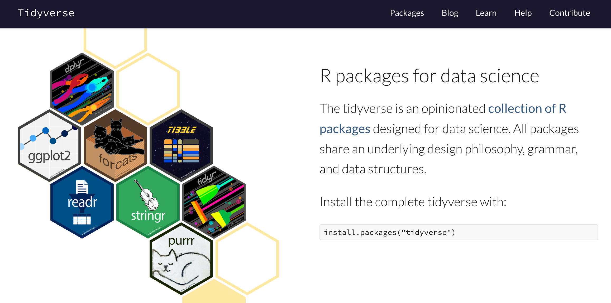
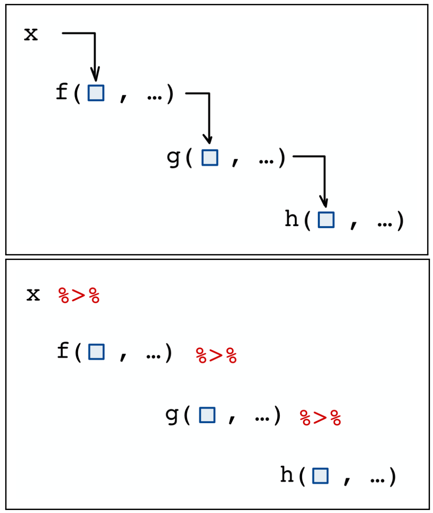

```{css, echo = F}
.badCode {
background-color: LIGHTGOLDENRODYELLOW;
}
/* dos columnas */
.column-left{
  display: inline-block;
  width: 48%;
  text-align: left;
  vertical-align: middle;
}
.column-right{
  display: inline-block;
  width: 48%;
  text-align: left;
  vertical-align: middle;
}

pre code, pre, code {
  white-space: pre !important;
  overflow-x: scroll !important;
  word-break: keep-all !important;
  word-wrap: initial !important;
}
```

```{r setup, include=FALSE}
library(knitr)
library(tidyverse)
library(checkdown)
library(details)
library(wakefield)
library(randomNames)
library(kableExtra)
#library(learnr)
opts_chunk$set(echo = TRUE, comment = NULL, warning = F, 
               message = F, fig.align = 'center', class.output="badCode",
               fig.width = 3.4, fig.height = 3)
```

```{r colFmt, include = F}
# Funcion para colorear texto a discrecion en Rmarkdown
# tomada de: https://stackoverflow.com/questions/29067541/how-to-change-the-font-color
colFmt = function(x,color){
  outputFormat = knitr::opts_knit$get("rmarkdown.pandoc.to")
  if(outputFormat == 'latex')
    paste("\\textcolor{",color,"}{",x,"}",sep="")
  else if(outputFormat == 'html')
    paste("<font color='",color,"'>",x,"</font>",sep="")
  else
    x
}
colpkg <- function(x) colFmt(x = x, color = "goldenrod")
```


```{r klippy, echo=FALSE, include=TRUE}
klippy::klippy(position = "right")
```

```{r, echo = F, eval = F}
rintimg::img_intensify(target = ".png")  # para hacer zoom en imagenes
# Nota: el problema con esto es que tambien incluye la imagen del icono
# que pone el paquete klippy en la esquina superior de los chunk's de codigo
# entonces cuando se hace clic en este icono para copiar el codigo
# se agranda la imagen del codigo y esto es molesto.
```

***

El **tidyverse** es una colección de paquetes diseñados para _data science_ y que comparten un modo de trabajo similar. En este recurso aprenderemos el uso de algunos comandos del paquete **dplyr**, quizas uno de los más utilizados del **tidyverse**.

```{r, echo = F, fig.width=8, fig.height=4.5, out.width="70%", fig.cap='Página web del tidyverse: <https://www.tidyverse.org/>{target="Blank0"}'}

```

<br>

Para activar los paquetes del **tidyverse** use el siguiente código:

```{r, eval = F}
library(tidyverse)  # activando paquetes del tidyverse (dplyr, ggplot2, tidyr, etc.)
```

***

<br>

## Operador "pipe" (`%>%` ó `|>`)

Este operador permite pasar el objeto que esta a su izquierda como **primer** argumento del comando que está a su derecha, y con esto, favorece la escritura de código donde se deben usar varios comandos, uno detras de otro, para transformar un objeto.

<div class="column-left">
El operador `%>%` (ó `|>`) pasa el objeto a su izquierda como primer argumento del comando a su derecha. Es decir, el código:

<center>
`f(x,y)`
</center>


es equivalente a

<center>
`x %>% f(y)`

`x |> f(y)`
</center>

</div>
<div class="column-right">
```{r, echo = F, fig.width=3, fig.height=4.5, out.width="60%"}

```
</div>

<br>

## Paquete dplyr y comandos revisados

**dplyr** es un paquete que permite manipular data.frame's o tibble's bajo la idea de la _gramática_ de la manipulación de datos. Bajo esta idea, el paquete provee un conjunto de verbos (comandos) que permiten solucionar los retos principales (agregar columnas, seleccionar columnas, filtrar filas, resumir, etc.) en la manipulación de datos; estos comandos se pueden ir aplicando por "capas", o de forma secuencial,  para transformar una tabla de múltiples formas. Para potenciar la idea de la _gramática_ de la manipulación, se recomienda encadenar los comandos mediante el operador "pipe" `%>%` (o `|>`). Algunos de los comandos principales del paquete  `dplyr` se muestran en la siguiente tabla:

```{r, echo = F}
tibble(
 Comando = c("`mutate`", "`select`", "`filter`", "`summarise`", 
             "`arrange`", "`tally` ó `count`", "`group_by`", "`ungroup`",
             "`pull`"),
 Descripción = c(
   "Adiciona nuevas variables que pueden ser o no funciones de las exitentes",
   "Selecciona variables por sus nombres o por posición",
   "Filtrar filas de acuerdo a expresiones lógicas",
   "Reduce (o colapsa) múltiples filas a una sóla medida de resumen",
   "Ordena filas de acuerdo a variables",
   "Cuenta valores únicos para una o múltiples variables",
   "Agrupa por una o múltiples varibles. Al aplicar comandos tales como `summarise`, `arrange` o `tally`, las operaciones se realizan por grupo",
   "Remueve el atributo de _agrupado_ asignado por `group_by`",
   "Extrae los valores de una columna como un vector (similar a lo que hace `$`)")
) %>%
  kable() %>%
  kable_styling(full_width  = F) %>%
  column_spec(2, width = "35em")
```


Descargue una hoja de referencia actualizada del paquete **dplyr** [aquí](https://github.com/rstudio/cheatsheets/blob/main/data-transformation.pdf){target="Blank5"}. También puede consultar la ayuda de cada comando usando el código: `?mutate`, `?summarise`, etc.

<br>

## Datos

```{r}
library(mosaicData)
data(Gestation)
?Gestation
gest <- as.data.frame(Gestation)
str(gest)
```

<br>

## Aplicación de comandos

Todos los comandos de **tidyverse** incluyendo aquellos del paquete `dplyr` reciben como 1er. argumento un data.frame o tibble y devuelven un data.frame o tibble, de ahí que sean facialmente encadenados por el operador "pipe" (`%>%` ó `|>`). Los argumentos siguientes dependerán del comando. Considere los siguientes ejemplos.

<br>

### Comandos `mutate` y `select`

- La variable `wt.1` tiene el peso de la madre antes del embarazo en libras (pouns), crear una nueva variable `wt.2` que tenga este mismo peso pero en kilogramos. Ayuda: 1 libra = 0.454 kg.

- A partir de la variable `gestation` la cual está en días, crear una nueva variable `gestation2` que tenga la duración de la gestación en meses. Ayuda: 1 mes = 30 días.

- Imprima las seis primeras filas de la tabla con las cuatro variables involucradas en los cálculos anteriores para verificar los cambios.

<br>

```{r}
gest %>%
  mutate(
    wt.2 = wt.1 * 0.454,             # libra a kg
    gestation2  = gestation / 30,    # dias a meses
  ) %>%
  select(id, wt.1, gestation, wt.2, gestation2) %>%
  head()
```

<br>

### Comando `filter`

Imprima las filas de la tabla que cumplan con tener una edad de la madre menor o igual a 25 años y que sean de raza `asian`. De este grupo, imprima las columnas `id`, `age`, `race` y `wt` en gramos. Ordene la impresión de acuerdo a `wt`. 


```{r}
gest %>%
  filter(age <= 25 & race == "asian") %>%
  mutate(wt = wt * 28.3495) %>%
  select(id, age, race, wt) %>%
  arrange(wt)
```


<br>

### Comandos `summarise` y `group_by`

- Calcule la cantidad de filas, la media y la desviación estándar del peso al nacimiento para las `r nrow(gest)` filas de la tabla.

- Calcule la cantidad de filas, la media y la desviación estándar del peso al nacimiento para cada raza de la madre. Imprima ordenando por la media.

```{r}
# Para todas las filas:
gest %>%
  summarise(
    n = n(),
    peso.nac_mean = mean(wt),
    peso.nac_sd = sd(wt)
  )

# Por raza:
gest %>%
  group_by(race) %>%
  summarise(
    n = n(),
    peso.nac_mean = mean(wt),
    peso.nac_sd = sd(wt)
  ) %>%
  arrange(
    peso.nac_mean
  )
```

<br> 

Observe que comandos como `mean` o `sd` devuelven un sólo valor. Sin embargo, ciertos comandos de estadística descriptiva pueden devolver más de un valor, por ejemplo:

```{r}
range( gest$wt )       # rango de los datos
quantile( gest$wt )    # quantiles, por defecto, 0,0.25,0.5,0.75,1
quantile( gest$wt, prob = c(0.25, 0.75) )
summary( gest$wt )     # resumen con varios estadisticos
```

<br> 

Tenga cuidado de aplicar alguno de estos comandos con `summarise`, pues a pesar de que se puede hacer, el comando `summarise` mantiene una sóla columna para los resultados, pero crea una fila para cada valor resultante de la función. Entonces se recomienda crear una columna adicional con un vector dando los nombres de los resultados de la función. Aquí un ejemplo:

```{r}
gest %>%
  group_by(race) %>%
  summarise(
    n = n(),
    q = quantile(wt, prob = c(0.25, 0.75)),
    prob = c(25, 75)
  )
```


<br>

## Ejercicios

### Ejer. 1

Transforme la altura de la madre de pulgadas a centímetros en una nueva columna. Igualmente, pase el peso al nacimiento de onzas a gramos en una nueva columna. Imprima las primeras seis filas de la tabla con las columnas involucradas en los cálculos para verificar los cambios.

:::: {.orangebox data-latex=""}

**Código solución**

```{r, results = 'hide', class.source = "fold-hide"}
gest %>%
  mutate(
    ht.cm = ht * 2.54,               # pulgadas a cm
    wt.g  = wt * 28.3495,            # onzas a gramos
  ) %>%
  select(id, ht, ht.cm, wt, wt.g) %>%
  head()
```

::::

<br>


### Ejer. 2

Defina tres intervalos para la variable `gestation`, llámelos `corta`, `media`, `larga`; calcule el mínimo, el máximo, la media y la desviación estándar del peso al nacimiento en gramos para cada categoría de `smoke` e intervalo de gestación. Intente gráficar el peso medio al nacimiento en función de las categorías de `smoke` partiendo por intervalos de gestación.

:::: {.orangebox data-latex=""}

**Código solución**

```{r, results = 'hide', fig.show = 'hide', class.source = "fold-hide"}
# Identifique la distribucion de la gestacion
gest |>
  mutate(gestation = gestation / 30) |>
  pull(gestation) |>
  summary()

# Identificando las categorias de smoke
count(gest, smoke)

# Aqui vamos:
res <- gest |>
  filter(!is.na(smoke) & !is.na(gestation) & !is.na(wt) ) |>
  mutate(
    gestation = cut(gestation / 30, br = c(4,9,10,12), labels = c('corta', 'media', 'larga')),
    smoke     = fct_relevel(smoke, "now", after = Inf),
    wt        =  wt * 28.3495 
  )  |>
  group_by(gestation, smoke) |>
  summarise(
    n = n(),
    min = min(wt),
    max = max(wt),
    media = mean(wt),
    de    = sd(wt)
  )

res

# Media general del peso al nac
media.wt <- weighted.mean(x = res$media, w = res$n)

# Grafico
ggplot(res, aes(y = smoke, x = media)) + geom_point(size = 4) +
  geom_errorbar(aes(xmin = media - de, xmax = media + de), 
                width = 0.2) +
  geom_vline(xintercept = media.wt)
  facet_grid(~ gestation, labeller = label_both) +
  labs(x = 'Peso al nacimiento (g)')
```

::::

<br>


